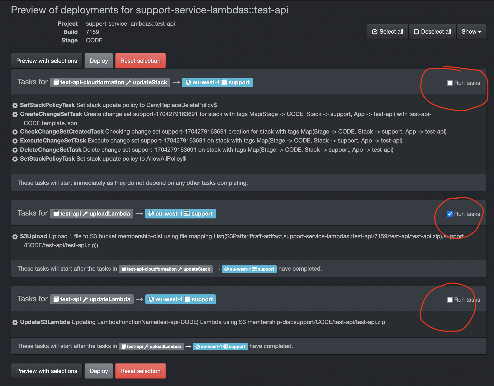

# How to create a new Lambda
This document is a work in progress, please add edits/updates!

## Important! Deploying a lambda with riffraff for the first time
If you are deploying a lambda for the first time you will need to follow these steps or the deploy will fail:
1. preview the deploy using riffraff and uncheck all tasks except the `uploadLambda` one before hitting deploy as shown in this screenshot:

1. go back to the deploy screen and deploy as normal (all the tasks)
1. set up [continuous deployment](https://riffraff.gutools.co.uk/deployment/continuous) for future deploys (optional)

## Typescript lambdas
### Api Gateway with a custom domain name
We have a code generation script (using [Hygen](https://www.hygen.io/)) which will generate a scaffold for new lambdas 
with an API Gateway front end and a custom domain name. To use it run `pnpm new-lambda` at the root of the repo, you will be prompted to 
- provide a name for 
your new lambda - the convention is to use a hyphenated name such as `my-new-lambda`.
- decide whether to create an api key for your lambda - the default is to do so.

This will then carry out the following actions:
1. create a new subdirectory of `\handlers` with the name of your new lambda
1. add a `package.json` a `riff-raff.yaml`, a `tsconfig.json` and a `src\index.ts` file to this directory
1. add a new CDK lib definition for your new lambda and the related infrastructure into the `cdk\libs` directory
1. create a new instance of that lib in [cdk.ts](https://github.com/guardian/support-service-lambdas/blob/1d30b16d34554d780f2e21018bf7ab6ac02209e4/cdk/bin/cdk.ts)
1. add the new project to [ci-typescript.yml](https://github.com/guardian/support-service-lambdas/blob/647299d94b471d0065030bce692a4631078346bb/.github/workflows/ci-typescript.yml)
so that it is built in Github

You can test this has worked by pushing your branch and deploying to code (take note of important deployment note above).
You should then be able to call your lambda with cUrl 
```shell
curl --location 'https://my-new-lambda-code.membership.guardianapis.com/prod'
```
and receive a 200 response with the body 'Hello World'.

You can then go ahead and write your lambda in `my-new-lambda\index.ts`


## Scala lambdas
### Api Gateway with a custom domain name
1. copy the sf-contact-merge lambda
1. delete all the code from the handler that you don't need
1. search and replace all sf-contact-merge in the code/packages/cfn with your chosen name
1. change the ApiGatewayTargetDomainName for CODE and PROD to tbc.execute-api.eu-west-1.amazonaws.com
1. push the branch and deploy to code
1. look at the [custom domain name](https://eu-west-1.console.aws.amazon.com/apigateway/home?region=eu-west-1#/custom-domain-names) that was created by the deploy
1. look at the target domain name in the regional box (should start d-4765437.execute-api.eu-west-1.amazonaws.com or similar)
1. edit the ApiGatewayTargetDomainName to point to the target domain name
1. raise a PR with the PROD still showing tbc and get it merged
1. deploy to prod with riff-raff (see steps below)
1. follow the steps after "deploy to code" again in order to update the PROD domain name.
1. set up a health check job in Runscope (optional)

**IMPORTANT:** The `IntegrationHttpMethod` (between API Gateway with Lambda) needs to always be `POST` - see https://stackoverflow.com/a/55457240/5205022 for more information

**NOTE:** If you make subsequent configuration changes to the API Gateway (even via CloudFormation) you may need to manually 'Deploy API' which can be done via the AWS Console (API Gateway > _{gateway in question}_ > Resources > Actions ▼ > Deploy API)


