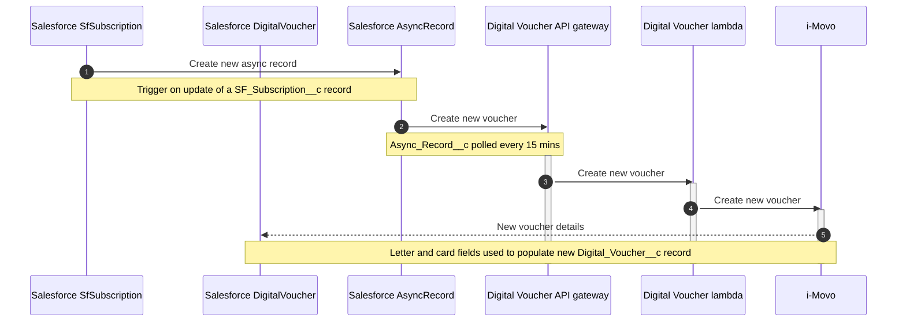
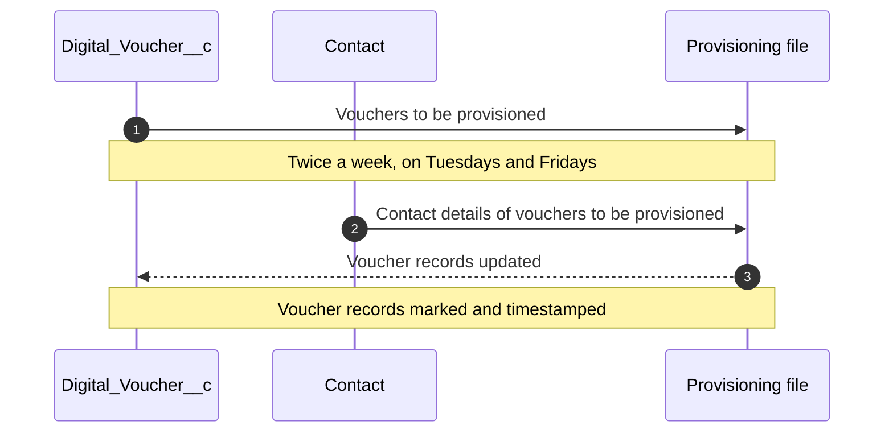
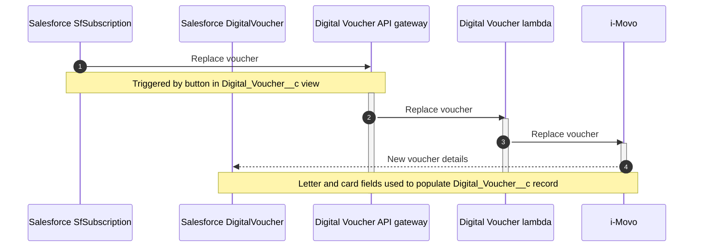

Digital Voucher API
====================

This api provides access to Imovo's digital voucher services. This supports the provisioning and 
management of Imovo's cards used by customers to redeem subscriptions.

Digital vouchers are also known as **Subscription Cards**.

---

## Digital voucher lifecycle

Digital vouchers are managed by i-Movo and cards are physically sent out by a third-party supplier.

Customers are provided with a plastic card and a letter.  With the card they can buy a newspaper on
the days they have subscribed to at any participating newsagent.  Alternatively, they can give the
letter to a single newsagent and pick up the newspaper there on the days that they've subscribed to.

### Creation

A digital voucher is created at i-Movo and in Salesforce
whenever a new subscription of the digital voucher type is created in Salesforce.



1. When a `SF_Subscription__c` record is updated in Salesforce with the digital voucher product type
   as part of the subscription creation process, this triggers the creation of a new `Async_Record__c`
   record.
2. The `Async_Record__c` object is polled every 15 minutes and if there is an outstanding record for
   creation of a digital voucher, a message is sent to the digital voucher API.
3. The API gateway forwards the message to the
   [digital voucher API lambda](https://eu-west-1.console.aws.amazon.com/lambda/home?region=eu-west-1#/functions/digital-voucher-api-PROD?tab=code).
4. The digital voucher API sends a message to the i-Movo API to create the voucher, using the ID of
   the Salesforce `SF_Subscription__c` record as the key.  We use this as the key, rather than the
   subscription name, because it has no real-world meaning.
5. The i-Movo API generates a card code and a letter code and returns them.  These are then returned
   through the digital voucher API back as the response to the originating request from Salesforce.  A
   new `Digital_Voucher__c` record is then created with fields for card code and letter code.  This
   record has a foreign key to the corresponding `SF_Subscription__c` record.

See also
[Digital Voucher Subscription Creation Flow](https://docs.google.com/drawings/d/1n3SggwkGKnctdxwwLHnljq666tCBbhsN11LtfiMDVJc).

### Provisioning

Digital voucher cards and letters are provisioned by a top-secret third party.  
Adding this here for completeness, but it doesn't involve the digital voucher API and neither does
it involve i-Movo.  
The whole process is inside Salesforce.



1. A batch job runs twice a week on Tuesdays and Fridays.  It queries for vouchers that are to be
provisioned either because they are newly [created](#creation) or because they have been 
[replaced](#replacement).
2. Joined contact records are also queried to produce a list of details for the provisioning partner
to download from Salesforce documents.
3. Voucher records included in the provisioning file are marked and timestamped as provisioned.

See also 
[Digital Voucher Fulfilment Flow](https://docs.google.com/drawings/d/1sST8IEnbWDsF6TTiHm5U_5ODPz2fWSr-OuKjzZ3Lers).

### Replacement

Customers can ask CSRs to send out a replacement voucher.  
A letter and card can only be replaced together.

This can only be done once a day but there seems to be an occasional bug where CSRs are able to make
multiple replacement requests for a subscription in a single day.  This is probably because of a
timeout in the digital voucher API but it needs more investigation.

The replacement operation is synchronous so that the CSR gets the new voucher information back
immediately.  
It's unclear why they need this information immediately.



1. In the `SF_Subscription__c` record view for a subscription joined to a digital voucher, there's a
   button to replace vouchers.  
   This triggers a call to the digital voucher API to replace the voucher.  The Salesforce UI suggests
   that cards and letters can be replaced independently but that doesn't seem to be the case.
2. The API gateway forwards the message to the
   [digital voucher API lambda](https://eu-west-1.console.aws.amazon.com/lambda/home?region=eu-west-1#/functions/digital-voucher-api-PROD?tab=code).
3. The digital voucher API sends a message to the i-Movo API to replace the voucher, using the ID of
   the Salesforce `SF_Subscription__c` record as the key.
4. The i-Movo API generates a card code and a letter code and returns them.  These are then returned
   through the digital voucher API back as the response to the originating request from Salesforce.
   The `Digital_Voucher__c` record card code and letter code fields are then updated with the new
   codes generated by i-Movo.

See also
[Digital Voucher Subscription Replacement Flow](https://docs.google.com/drawings/d/1BLTTVQQht1AK5QqS7k8wMU2LYrirzKWfbD-as6CVFaw).

### Holiday stop

See
[digital-voucher-suspension-processor](../digital-voucher-suspension-processor/README.md).

### Cancellation

See
[digital-voucher-cancellation-processor](../digital-voucher-cancellation-processor/README.md).

---

Usage
=====

All endpoints require...

- `x-api-key` header (generated by the `DigitalVoucherApiKey` in the CloudFormation)

| Method | Endpoint                                                                   | Body                                                                                                             | Response                                                                                                                                                                                                                                     | Description                                                                                                                                                                         |
|--------|----------------------------------------------------------------------------|------------------------------------------------------------------------------------------------------------------|----------------------------------------------------------------------------------------------------------------------------------------------------------------------------------------------------------------------------------------------|-------------------------------------------------------------------------------------------------------------------------------------------------------------------------------------|
| GET    | /{STAGE}/digital-voucher/\<SALESFORCE_SUBSCRIPTION_ID\>                    |                                                                                                                  | {"cardCode":"\<Imovo Card Code\>","letterCode":"\<Imovo Letter Code\>"}                                                                                                                                                                      | Returns the Imovo digital subscription associated with the salesforce subscription id                                                                                               |
| PUT    | /{STAGE}/digital-voucher/create/\<SALESFORCE_SUBSCRIPTION_ID\>             | {"ratePlanName":"\<subscription rate plan name\>"}                                                               | {"cardCode":"\<Imovo Card Code\>","letterCode":"\<Imovo Letter Code\>"}                                                                                                                                                                      | Creates an Imovo digital subscription or returns the details of the subscription if it already exists                                                                               |
| POST   | /{STAGE}/digital-voucher/replace                                           | {"cardCode":"\<Imovo Card Code\>","letterCode":"\<Imovo Letter Code\>"}                                          | {"cardCode":"\<Imovo Card Code\>","letterCode":"\<Imovo Letter Code\>"}                                                                                                                                                                      | Forces an Imovo a new digital subscription invalidating the existing subscription associated with the salesforce subscription id                                                    |
| DELETE | /{STAGE}/digital-voucher/\<SALESFORCE_SUBSCRIPTION_ID\>                    |                                                                                                                  |                                                                                                                                                                                                                                              | Deletes an Imovo digital subscription                                                                                                                                               |
| PUT    | /{STAGE}/digital-voucher/\<SALESFORCE_SUBSCRIPTION_ID\>                    | {"ratePlanName":"\<subscription rate plan name\>"}                                                               | {"cardCode":"\<Imovo Card Code\>","letterCode":"\<Imovo Letter Code\>"}                                                                                                                                                                      | Creates an Imovo digital subscription or returns the details of the subscription if it already exists                                                                               |
| GET    | /{STAGE}/digital-voucher/\<SALESFORCE_SUBSCRIPTION_ID\>                    |                                                                                                                  | {"cardCode":"\<Imovo Card Code\>","letterCode":"\<Imovo Letter Code\>"}                                                                                                                                                                      | Gets the details of the Imovo digital subscription                                                                                                                                  |
| POST   | /{STAGE}/digital-voucher/replace                                           | {"subscriptionId":"\<SALESFORCE_SUBSCRIPTION_ID\>, \"replaceCard\": true/false\, \"replaceLetter\": true/false\} | {"cardCode":"\<Imovo Card Code\>","letterCode":"\<Imovo Letter Code\>"} or {"cardCode":"\<Imovo Card Code\>"} or {"letterCode":"\<Imovo Letter Code\>"}                                                                                      | Asks for a replacement card code, letter code or both from i-movo for a subscriptionId                                                                                              |
| POST   | /{STAGE}/digital-voucher/cancel                                            | {"subscriptionId":"\<SALESFORCE_SUBSCRIPTION_ID\>" ,"cancellationDate":"yyy-MM-dd"}                              | {}                                                                                                                                                                                                                                           | Cancels an Imovo subscription either immediately or on the cancellationDate if one is supplied                                                                                      |
| PUT    | /{STAGE}/digital-voucher/suspend                                           | {"subscriptionId":"\<SALESFORCE_SUBSCRIPTION_ID\>", "startDate":"yyy-MM-dd", "endDateExclusive":"yyy-MM-dd"}     | {}                                                                                                                                                                                                                                           | Suspends an Imovo subscription from the `startDate` to the `endDate` (exclusive).  Over this period the voucher letter will not accrue value and the voucher card will be disabled. |
| GET    | /{STAGE}/digital-voucher/redemption-history/\<SALESFORCE_SUBSCRIPTION_ID\> |                                                                                                                  | {redemptionAttempts: [{"voucherCode": "6027181854", "voucherType": "Card","actionDate": "2019-10-17T10:45:20.787","activityType": "Redemption", "address": "Russ's Test shop", "postCode": "CB2 1TN", "message": "Success", "value": 1.00}]} | Returns up to the last 20 redemption attempts                                                                                                                                       |

Config
======

The configuration for this application is stored in the [aws parameter store](https://docs.aws.amazon.com/systems-manager/latest/userguide/systems-manager-parameter-store.html).

The configuration can be updated using the [aws cli](https://docs.aws.amazon.com/cli/latest/userguide/install-cliv2.html). 

NOTE: Due to a 'feature' in the aws cli you either need to use v2 of the cli or have the following in your '~/.aws/config' file:

```
cli_follow_urlparam=false
``` 

For more details see: https://github.com/aws/aws-cli/issues/2507

Each parameter has a key derived from the configuration case class used in the application. See
[ConfigLoader](../../lib/config-cats/src/main/scala/com/gu/util/config/ConfigLoader.scala).

To update a 'non-secret' parameter use the following aws cli command:

```bash
aws --profile membership ssm put-parameter --overwrite --type String --name /<stage>/membership-<stage>-digital-voucher-api/digital-voucher-api-<stage>/<parameter key> --value <parameter value>
```

To update a 'secret' parameter such as api keys and passwords use the following aws cli command:

```bash
aws --profile membership ssm put-parameter --overwrite --type SecureString --key-id 302bd430-2d97-4984-8625-b55a70691b49 --name /<stage>/membership-<stage>-digital-voucher-api/digital-voucher-api-<stage>/<parameter key> --value <parameter value>
```

For example:
```$bash
aws --profile membership ssm put-parameter --overwrite --type String --name /DEV/membership-DEV-digital-voucher-api/digital-voucher-api-DEV/imovoBaseUrl --value  https://core-uat-api.azurewebsites.net
aws --profile membership ssm put-parameter --overwrite --type SecureString --key-id 302bd430-2d97-4984-8625-b55a70691b49 --name /DEV/membership-DEV-digital-voucher-api/digital-voucher-api-DEV/imovoApiKey --value xxxxxx
```