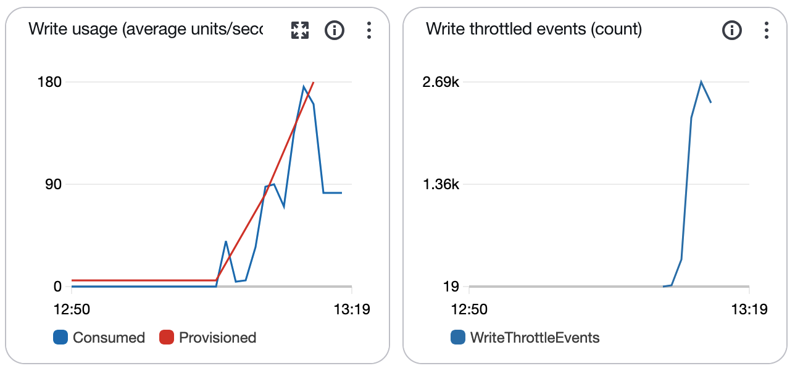

# generate-product-catalog lambda

This lambda takes a DynamoDB stream of changes to the `user-subscriptions` table in the `gu-aws-mobile` account 
and updates the `SupporterProductData` account.

## Running a full sync
To run a full sync of all subscriptions from the mobile purchases `user-subscriptions` table to `SupporterProductData` 
you can use the `runFullSync` command. This needs fresh Janus credentials and a CSV file containing data for all the subscriptions to sync. 
You can generate this data using the following BigQuery SQL query:
```sql
SELECT
  us.user_id,
  us.subscription_id,
  s.product_id,
  s.start_timestamp,
  s.end_timestamp
FROM
  `datatech-fivetran.mobile_purchases.mobile_purchases_prod_subscriptions` s
LEFT JOIN
  `datatech-fivetran.mobile_purchases.mobile_purchases_prod_user_subscriptions` us
ON
  s.subscription_id = us.subscription_id
WHERE
  1 = 1
  AND user_id IS NOT NULL
  AND us.subscription_id IS NOT NULL
  AND s.end_timestamp > CURRENT_TIMESTAMP()
```
### Important - as this file contains personal data you should delete it as soon as you are done with it.

You can then run the full sync command like so:
```bash
# the runFullSync command expects a stage (CODE or PROD) and the path to the CSV file as arguments
pnpm --filter mobile-purchases-to-supporter-product-data runFullSync CODE '/Users/my_user_name/delete_me/users.csv'
```

A full sync will take several hours to run and there are a few things to watch while it is in progress:
The SupporterProductData Dynamo table is configured with auto-scaling write capacity, but you may see some throttling occurring before it 
scales up to the required capacity. You can monitor this in the 'Monitor' tab of the Dynamo AWS console page for the table.

You can also monitor the CloudWatch logs for the lambda to see throttling errors occurring.
### Important - Because the lambda is driven from an SQS queue (`supporter-product-data-PROD`), these errors will be retried automatically. 
No action is required unless records appear on the dead-letter queue (`dead-letters-supporter-product-data-PROD`). In this case you will need to investigate the cause of the failures and reprocess the records manually after fixing the underlying issue.