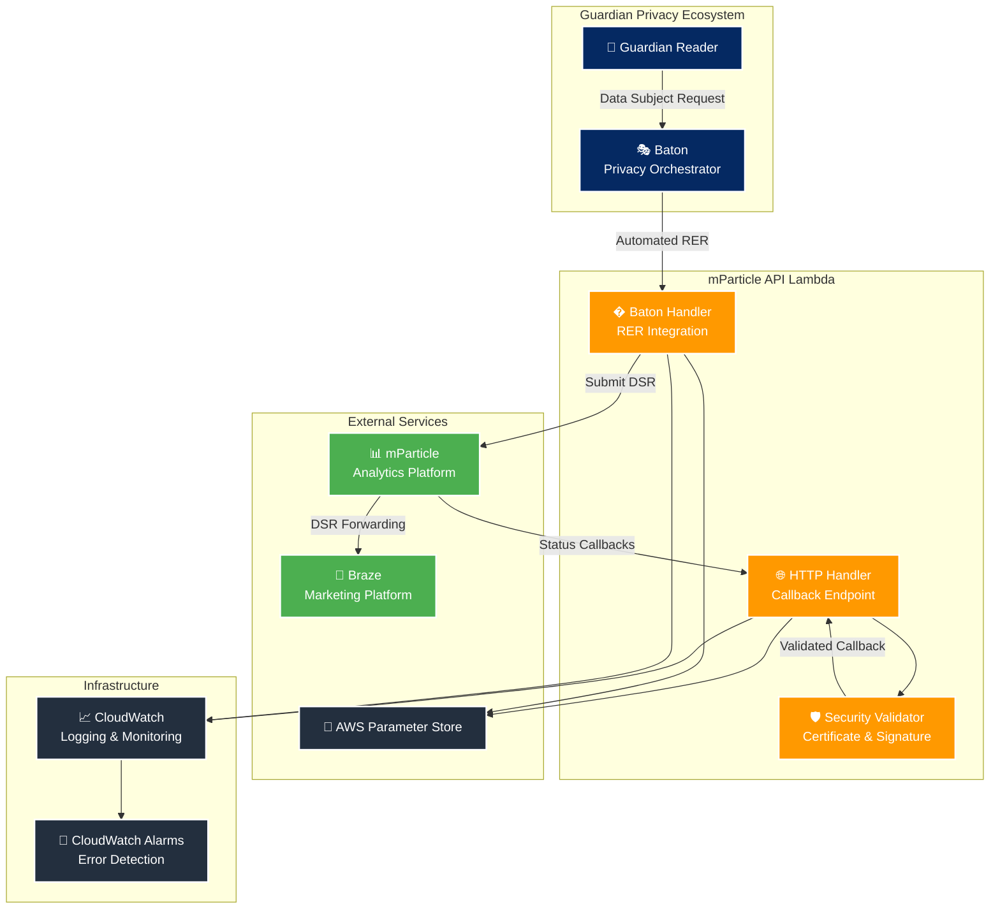
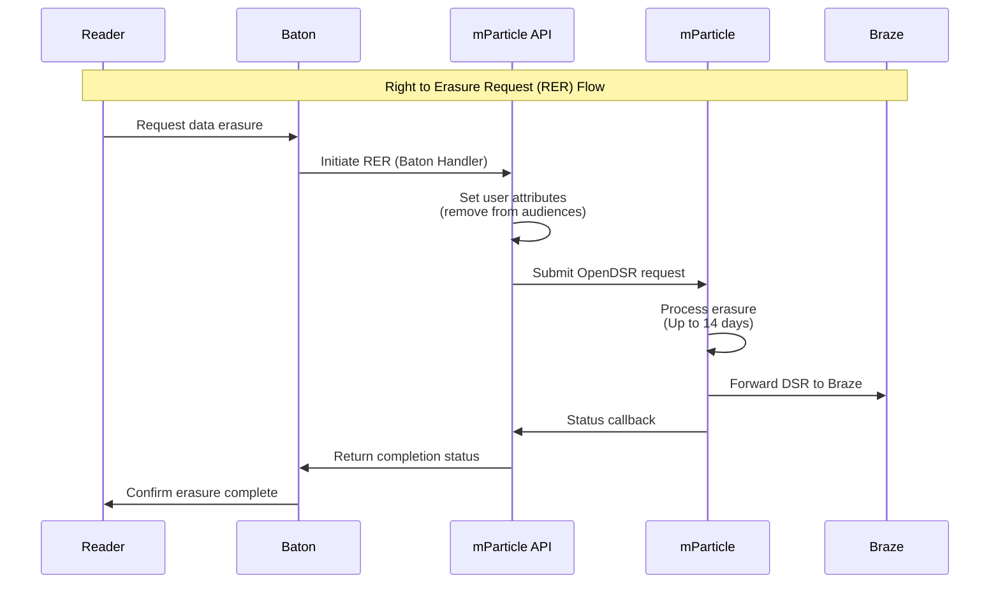

# mParticle API Lambda

**A privacy-compliant data processing bridge between Guardian and mParticle's APIs.**

## 🌟 Overview

The mParticle API Lambda enables Guardian to fulfill GDPR and CCPA compliance requirements by providing a secure, scalable interface to mParticle's Data Subject Request (DSR) API. It processes privacy requests, tracks their status, and coordinates with Guardian's broader privacy ecosystem.

### Key Capabilities
- 🔒 **Privacy Rights Fulfillment**: Process data deletion and export requests
- 📊 **Real-time Status Tracking**: Monitor DSR progress with callback integration  
- 🤖 **Automated Workflows**: Integrate with Baton for orchestrated privacy operations
- 📈 **Analytics Forwarding**: Route event data to mParticle and downstream systems
- 🛡️ **Enterprise Security**: Certificate validation and signature verification on callbacks from mParticle

### Compliance & Standards
- **GDPR Article 17**: Right to Erasure implementation
- **CCPA Section 1798.105**: Consumer data deletion rights
- **X.509 Certificate Validation**: Cryptographic security for callbacks
- **AWS Security Best Practices**: Encrypted data storage and Parameter Store configuration

---

## � What is mParticle?

[mParticle](https://www.mparticle.com/) is a customer data platform that helps organizations collect, manage, and activate customer data across multiple touchpoints. It serves as a central hub for data collection and distribution.

### Core Features
- **Data Collection**: Unified SDK for collecting customer data from web, mobile, and server-side sources
- **Data Orchestration**: Real-time data routing to 300+ marketing, analytics, and data warehouse integrations
- **Identity Resolution**: Cross-platform customer identity management and unification
- **Audience Management**: Dynamic audience creation and real-time segmentation
- **Privacy Controls**: Built-in data governance and privacy compliance tools

### Official Resources
- [mParticle Documentation](https://docs.mparticle.com/)
- [Data Subject Request API](https://docs.mparticle.com/developers/dsr-api/)
- [Privacy Controls Overview](https://docs.mparticle.com/guides/data-privacy-controls/)

---

## 📧 What is Braze?

[Braze](https://www.braze.com/) is a customer engagement platform that enables personalized messaging across email, push notifications, in-app messages, SMS, and web push.

### Core Features
- **Multi-Channel Messaging**: Email, push, SMS, in-app, and web messaging
- **Personalization Engine**: AI-powered content personalization and optimization
- **Journey Orchestration**: Automated, cross-channel customer journey campaigns
- **Real-Time Analytics**: Campaign performance tracking and user behavior analytics
- **A/B Testing**: Comprehensive testing framework for message optimization

### Official Resources
- [Braze Documentation](https://www.braze.com/docs/)
- [Data Privacy & Protection](https://www.braze.com/docs/developer_guide/disclosures/security_qualifications/)
- [GDPR Compliance Guide](https://www.braze.com/docs/help/gdpr_compliance/)

---

## 🔗 mParticle and Braze Integration

mParticle and Braze work together to create a comprehensive data and engagement ecosystem for The Guardian's digital audience.

### Data Flow Architecture
```
Guardian Apps/Website → mParticle → Braze → Personalized Communications
```

### How They Work Together

#### 1. **Data Collection & Unification**
- **mParticle Role**: Collects user interaction data from Guardian's websites and mobile apps
- **Data Types**: Page views, article reads, subscription events, user preferences
- **Identity Resolution**: Creates unified user profiles across devices and platforms

#### 2. **Audience Segmentation**
- **mParticle Role**: Creates dynamic audience segments based on behavior patterns
- **Examples**: "Regular readers", "Subscription likely", "Weekend browsers"
- **Real-Time Updates**: Segments update as user behavior changes

#### 3. **Engagement Activation**
- **Braze Role**: Receives audience data from mParticle for targeted messaging
- **Message Types**: Newsletter subscriptions, breaking news alerts, subscription offers
- **Personalization**: Content tailored based on reading history and preferences

#### 4. **Privacy Compliance**
- **Data Subject Requests**: When users request data deletion, both platforms must be coordinated
- **mParticle**: Removes user data and audience memberships
- **Braze**: Deletes user profiles and message history via mParticle's DSR forwarding

### Why This Integration Matters
- **Unified Experience**: Consistent messaging across all Guardian touchpoints
- **Privacy Compliance**: Coordinated data handling ensures GDPR/CCPA compliance
- **Personalization**: Reader engagement improves through data-driven content delivery
- **Operational Efficiency**: Single data pipeline reduces complexity and maintenance

### Official Integration Resources
- [mParticle + Braze Integration Guide](https://docs.mparticle.com/integrations/braze/audience/)
- [Braze mParticle Partnership](https://www.braze.com/partners/technology-partners/mparticle/)

---

## 🏗️ System Architecture



## Service Integration Flow



---

## 🚀 Quick Start

### Prerequisites
- Node.js 18+ and pnpm
- AWS CLI configured with Parameter Store access (using Janus)
- Basic understanding of Lambda and API Gateway

### Installation
```bash
# Install dependencies
pnpm install

# Build the project  
pnpm build

# Run tests
pnpm test
```

### Configuration
All configuration is managed through AWS Parameter Store. Ensure these parameters are set for your environment:

#### Workspace Credentials
- **`/{stage}/support/mparticle-api/workspace/key`**
  - *Description*: mParticle workspace API key for Data Subject Request operations
  - *mParticle Reference*: [Managing Workspaces](https://docs.mparticle.com/guides/platform-guide/introduction/#managing-workspaces)

- **`/{stage}/support/mparticle-api/workspace/secret`**
  - *Description*: mParticle workspace API secret for Data Subject Request operations
  - *mParticle Reference*: [Managing Workspaces](https://docs.mparticle.com/guides/platform-guide/introduction/#managing-workspaces)

#### Input Platform Credentials
- **`/{stage}/support/mparticle-api/inputPlatform/key`**
  - *Description*: mParticle input platform API key for event ingestion and data collection
  - *mParticle Reference*: [HTTP APIs Authentication](https://docs.mparticle.com/developers/apis/http/#authentication)

- **`/{stage}/support/mparticle-api/inputPlatform/secret`**
  - *Description*: mParticle input platform API secret for event ingestion and data collection
  - *mParticle Reference*: [HTTP APIs Authentication](https://docs.mparticle.com/developers/apis/http/#authentication)

#### Environment Configuration
- **`/{stage}/support/mparticle-api/pod`**
  - *Description*: mParticle pod/cluster identifier (e.g., "us1", "us2", "eu1") for regional API endpoints
  - *mParticle Reference*: [Data Hosting Locations](https://docs.mparticle.com/developers/guides/data-localization/)

---

## 🌐 HTTP API Endpoints

### Base URLs
| Environment | URL |
|-------------|-----|
| **CODE** | `https://mparticle-api-code.support.guardianapis.com` |
| **PROD** | `https://mparticle-api.support.guardianapis.com` |

### HTTP Router Endpoints

| Method | Path | Handler | Purpose |
|--------|------|---------|---------|
| `POST` | `/data-subject-requests` | `submitDataSubjectRequestHandler` | Submit new DSR |
| `GET` | `/data-subject-requests/{requestId}` | `getDataSubjectRequestStatusHandler` | Query DSR status |
| `POST` | `/data-subject-requests/{requestId}/callback` | `dataSubjectRequestCallbackHandler` | mParticle status updates |
| `POST` | `/events` | `uploadEventBatchHandler` | Upload event batches |

#### Submit Data Subject Request
- **Purpose**: Submit a new Data Subject Request to mParticle
- **Security**: Zod schema validation
- **Request Schema**: `{ email: string, type: "delete" | "ccpa_delete" | "gdpr_delete" | "export", regulation?: string }`
- **Response**: Request ID and initial status

#### Query Request Status  
- **Purpose**: Retrieve current status of submitted DSR
- **Path Parameter**: `requestId` - unique DSR identifier
- **Response**: Status, timestamps, and download URLs (for exports)

#### Status Callback Handler
- **Purpose**: Receive status updates from mParticle
- **Security**: X.509 certificate + RSA-SHA256 signature validation
- **Public Access**: Secured through certificate validation
- **Headers**: `X-MP-Signature`, `X-MP-Certificate`

#### Upload Event Batch
- **Purpose**: Forward analytics events to mParticle
- **Request Schema**: `{ events: Array<{ event_type: string, data: Record<string, any>, timestamp?: number, user_id?: string, session_id?: string }> }`
- **Processing**: Event transformation and batch forwarding

---

## 🤖 Baton Integration Events

### Baton Router Events

| Action | Handler | Purpose |
|--------|---------|---------|
| `initiate` | `handleInitiateRequest` | Initiate RER via Baton |
| `status` | `handleStatusRequest` | Check DSR status for Baton |

#### Initiate RER Request Event
- **Action**: `initiate`
- **Request Schema**:
  ```typescript
  {
    requestType: "RER",
    action: "initiate", 
    subjectId: string,
    subjectEmail?: string,
    dataProvider: "mparticlerer"
  }
  ```
- **Response Schema**:
  ```typescript
  {
    requestType: "RER",
    action: "initiate",
    status: "pending" | "completed" | "failed",
    message: string,
    initiationReference: GUID
  }
  ```
- **Flow**: Identity resolution → DSR submission → correlation tracking

#### Status Check Event
- **Action**: `status`
- **Request Schema**:
  ```typescript
  {
    requestType: "RER",
    action: "status",
    initiationReference: GUID
  }
  ```
- **Response Schema**:
  ```typescript
  {
    requestType: "RER", 
    action: "status",
    status: "pending" | "completed" | "failed",
    message: string
  }
  ```
- **Flow**: Request validation → mParticle API query → status resolution

### Cross-Account Security
- **Method**: IAM role-based Lambda invocation
- **Trust Relationship**: Baton account → mParticle API account
- **Authentication**: Cross-account role assumption

---

## 🔒 Security & Compliance

### Security Features
- **Input Validation**: Comprehensive Zod schema validation
- **Certificate Validation**: X.509 certificate verification for callbacks
- **Signature Verification**: RSA-SHA256 signature validation
- **Cross-Account Security**: IAM role-based Baton integration

### Compliance Framework

#### GDPR (General Data Protection Regulation)
- **Article 17**: Right to Erasure implementation
- **Article 20**: Data Portability through export functionality
- **28-day response deadline**: Mandatory timeline for processing requests

#### CCPA (California Consumer Privacy Act)
- **Section 1798.105**: Consumer data deletion requests
- **Business day response**: Confirmation of request receipt
- **Verification process**: Identity confirmation before processing

### Certificate Validation Process
1. **Certificate Extraction**: Extract certificate from `X-MP-Certificate` header
2. **Chain Validation**: Verify complete certificate chain to trusted root
3. **Expiry Check**: Ensure certificate is within validity period
4. **Domain Validation**: Confirm certificate matches mParticle domain

### Signature Verification Process
1. **Signature Extraction**: Get RSA-SHA256 signature from `X-MP-Signature` header
2. **Public Key Extraction**: Extract public key from validated certificate
3. **Signature Verification**: Cryptographic verification of message integrity

---

## 🧪 Testing

### Test Structure
```
tests/
├── unit/
│   ├── handlers/
│   │   ├── httpRouter.test.ts       # HTTP endpoint tests
│   │   └── batonRouter.test.ts      # Baton integration tests
│   ├── services/
│   │   ├── mparticle.test.ts        # mParticle API client tests
│   │   └── validation.test.ts       # Certificate validation tests
│   └── schemas/
│       └── validation.test.ts       # Zod schema validation tests
├── fixtures/                        # Test data and mock responses
└── helpers/                         # Test utility functions
```

### Running Tests
```bash
# Run all tests
pnpm test

# Run with coverage
pnpm test --coverage

# Run specific tests
pnpm test httpRouter.test.ts

# Development mode
pnpm test --watch
```

---

## 🚨 Business Context & Compliance

### The Guardian's Data Ecosystem
The Guardian collects comprehensive reader data including:
- 📖 **Content Engagement**: Article views, reading time, interaction patterns
- 🎯 **Subscription Data**: Payment information, subscription preferences
- 📧 **Marketing Analytics**: Email engagement, campaign performance
- 📱 **Cross-Platform Behavior**: Mobile app usage, web interactions

This data flows through **mParticle** for analytics and audience segmentation, then forwards to **Braze** for marketing automation.

### Risk Mitigation
- **Automated processing** reduces manual errors
- **Centralized orchestration** via Baton ensures no system is missed
- **Real-time monitoring** detects and alerts on failures immediately

---

## 🔧 Development & Configuration

### Environment Variables
- `STAGE`: Deployment environment (CODE/PROD)
- `AWS_REGION`: AWS region for Parameter Store access

### Code Structure
```
src/
├── routers/              # Request routing logic
│   ├── http.ts            # HTTP API Gateway router
│   ├── baton.ts           # Baton integration router
│   ├── http/              # HTTP endpoint handlers
│   └── baton/             # Baton event handlers
├── apis/                 # External API clients
├── utils/                # Utility functions
└── index.ts              # Main entry point
```

### Development Scripts
```bash
pnpm build              # Compile TypeScript
pnpm test               # Run all tests
pnpm lint               # Run ESLint
pnpm check-formatting   # Format code with Prettier
pnpm fix-formatting     # Format code with Prettier
pnpm check-config       # Check configuration files
```

### Local Development
```bash
# Set environment
export STAGE=CODE
export AWS_REGION=eu-west-1
```

### Deployment
Managed through AWS CDK with environment-specific configurations.

---

## 📞 Support & Monitoring

### Team Information
- **Primary Owner**: Value Team
- **Slack Channel**: [@P&E/Value](https://chat.google.com/room/AAAAuotUxTg?cls=7)

### External Dependencies
- **mParticle DSR API**: Data subject request processing
- **AWS Parameter Store**: Configuration management
- **CloudWatch**: Logging and monitoring
- **Baton**: Privacy workflow orchestration

---

## 🤝 Integration Points

### Baton Privacy Orchestration
The Lambda integrates with Guardian's Baton system for automated privacy workflows:
- Cross-account Lambda invocation
- Correlation tracking for multi-service requests
- Status synchronization across privacy processors

### mParticle Data Subject Requests
Direct integration with mParticle's DSR API:
- Automated request submission and tracking
- Secure callback handling with certificate validation
- Status polling and update processing

---

## 📋 Quick Reference

### AWS Resources
- **Lambda Functions**: `mparticle-api-http-{stage}`, `mparticle-api-baton-{stage}`
- **API Gateway**: `mparticle-api-{stage}`
- **Parameter Store**: `/{stage}/support/mparticle-api/*`
- **Cross-Account Role**: `baton-mparticle-lambda-role-{stage}`

### Base URLs
| Environment | URL |
|-------------|-----|
| **CODE** | `https://mparticle-api-code.support.guardianapis.com` |
| **PROD** | `https://mparticle-api.support.guardianapis.com` |