# 🚀 mParticle API Lambda

> **Mission-Critical Privacy Compliance Service**  
> Enabling The Guardian to meet GDPR/CCPA requirements through automated data subject request processing with mParticle.


## 📋 Table of Contents

- [🎯 Business Context](#-business-context)
- [🏗️ Architecture Overview](#️-architecture-overview)
- [🔧 Core Features](#-core-features)
- [🌐 API Endpoints](#-api-endpoints)
- [🔒 Security & Compliance](#-security--compliance)
- [🚀 Getting Started](#-getting-started)
- [📊 Monitoring & Operations](#-monitoring--operations)
- [🤝 Integration with Baton](#-integration-with-baton)
- [🧪 Testing](#-testing)
- [🔧 Advanced Topics](#-advanced-topics)
- [📚 References](#-references)

## 🎯 Business Context

### Why This Matters

The Guardian is an **international newspaper with a global reputation** that must comply with strict privacy regulations. **Legal compliance failures can result in legal action**, making this service mission-critical for business operations.

### Key Business Requirements

- ⚖️ **Legal Compliance**: GDPR and CCPA mandate 28-day response times for data subject requests
- 🔒 **Data Privacy**: Secure handling of reader data across The Guardian's digital ecosystem
- 📊 **Audit Trail**: Complete logging and monitoring for regulatory compliance
- 🌍 **International Scope**: Supporting readers across different jurisdictions

### The Guardian's Data Ecosystem

The Guardian collects comprehensive reader data including:
- 📖 **Content Engagement**: Article views, reading time, interaction patterns
- 🎯 **Subscription Data**: Payment information, subscription preferences
- 📧 **Marketing Analytics**: Email engagement, campaign performance
- 📱 **Cross-Platform Behavior**: Mobile app usage, web interactions
- 🎫 **Event Participation**: Guardian Live events, community engagement

This data flows through **mParticle** for analytics and audience segmentation, then forwards to **Braze** for marketing automation.

## 🏗️ Architecture Overview

```mermaid
graph TB
    subgraph "Guardian Privacy Ecosystem"
        BATON[🎭 Baton<br/>Privacy Orchestrator]
        CSR[👤 CSR Team]
        READER[📱 Guardian Reader]
    end
    
    subgraph "mParticle API Lambda"
        HTTP[🌐 HTTP Handler<br/>API Gateway Routes]
        BATON_H[🔄 Baton Handler<br/>RER Integration]
        VALIDATOR[🛡️ Security Validator<br/>Certificate & Signature]
    end
    
    subgraph "External Services"
        MPARTICLE[📊 mParticle<br/>Analytics Platform]
        BRAZE[📧 Braze<br/>Marketing Platform]
        SECRETS[🔐 AWS Secrets Manager]
    end
    
    subgraph "Infrastructure"
        CW[📈 CloudWatch<br/>Logging & Monitoring]
        ALARMS[🚨 CloudWatch Alarms<br/>Error Detection]
    end

    %% Request Flows
    READER -->|Data Subject Request| CSR
    CSR -->|Manual Request| HTTP
    BATON -->|Automated RER| BATON_H
    
    %% Processing
    HTTP --> VALIDATOR
    BATON_H --> VALIDATOR
    VALIDATOR --> MPARTICLE
    
    %% Data Flow
    MPARTICLE -->|Status Callbacks| VALIDATOR
    MPARTICLE -->|DSR Forwarding| BRAZE
    
    %% Configuration
    HTTP --> SECRETS
    BATON_H --> SECRETS
    
    %% Monitoring
    HTTP --> CW
    BATON_H --> CW
    CW --> ALARMS

    classDef guardian fill:#052962,stroke:#ffffff,stroke-width:2px,color:#ffffff
    classDef lambda fill:#ff9900,stroke:#ffffff,stroke-width:2px,color:#ffffff
    classDef external fill:#4CAF50,stroke:#ffffff,stroke-width:2px,color:#ffffff
    classDef aws fill:#232F3E,stroke:#ffffff,stroke-width:2px,color:#ffffff
    
    class BATON,CSR,READER guardian
    class HTTP,BATON_H,VALIDATOR lambda
    class MPARTICLE,BRAZE external
    class SECRETS,CW,ALARMS aws
```



### Service Integration Flow


## 🔧 Core Features

### 🎯 Data Subject Request Management
- **Submit DSRs**: Accept access, portability, and erasure requests in OpenDSR format
- **Status Tracking**: Real-time monitoring of request progress through mParticle
- **Automated Callbacks**: Secure webhook processing for status updates

### 🛡️ Enterprise Security
- **Certificate Validation**: X.509 certificate chain verification for callbacks
- **Signature Verification**: RSA-SHA256 signature validation
- **Input Sanitization**: [Zod](https://zod.dev/) schema validation for all endpoints

### 📊 Event Processing
- **Batch Upload**: Efficient event forwarding to mParticle
- **User Attribution**: Audience control during erasure waiting periods
- **Environment Isolation**: Separate development and production workspaces

### 🔄 Baton Integration
- **Automated RER**: Seamless integration with Guardian's privacy orchestration platform
- **Cross-Account Access**: Secure Lambda invocation from Baton AWS account
- **Standardized Interface**: Implements Baton's DSR processing contract

## 🌐 API Endpoints

The service exposes two distinct sets of endpoints through different handlers:

### 🌐 HTTP Router (API Gateway - Public Endpoints)

The HTTP router handles public-facing endpoints accessible via API Gateway, primarily for manual DSR operations and mParticle callbacks.

#### 📝 Submit Data Subject Request
**Endpoint:** `POST /data-subject-requests`  
**Handler:** `submitDataSubjectRequestHandler`  
**Purpose:** Accept manual DSR submissions from CSR teams or direct API calls

```http
POST /data-subject-requests
Content-Type: application/json

{
  "regulation": "gdpr" | "ccpa",
  "requestId": "uuid-v4-string",
  "requestType": "access" | "portability" | "erasure", 
  "submittedTime": "2025-07-18T10:30:00Z",
  "userId": "guardian-identity-id",
  "environment": "production" | "development"
}
```

**Features:**
- Validates input using Zod schema (`dataSubjectRequestFormParser`)
- Sets user attributes to remove from audiences during waiting period
- Submits OpenDSR request to mParticle with callback URLs
- Returns expected completion time and tracking information

**Response (201 Created):**
```json
{
  "expectedCompletionTime": "2025-08-15T10:30:00Z",
  "receivedTime": "2025-07-18T10:30:01Z", 
  "requestId": "uuid-v4-string",
  "controllerId": "mparticle-workspace-id"
}
```

#### 📊 Query Request Status
**Endpoint:** `GET /data-subject-requests/{requestId}`  
**Handler:** `getDataSubjectRequestStatusHandler`  
**Purpose:** Check status of existing DSR by request ID

```http
GET /data-subject-requests/{requestId}
```

**Features:**
- Validates requestId as UUID in path parameters
- Queries mParticle DSR API for current status
- Returns comprehensive status information including results URL

**Response (200 OK):**
```json
{
  "expectedCompletionTime": "2025-08-15T10:30:00Z",
  "requestId": "uuid-v4-string", 
  "controllerId": "mparticle-workspace-id",
  "requestStatus": "pending" | "in_progress" | "completed" | "cancelled",
  "resultsUrl": "https://download-link-for-access-requests"
}
```

#### 🔄 Status Callback (mParticle → Lambda) **[PUBLIC ENDPOINT]**
**Endpoint:** `POST /data-subject-requests/{requestId}/callback`  
**Handler:** `dataSubjectRequestCallbackHandler`  
**Purpose:** Receive status updates from mParticle when DSR status changes

**⚠️ Public Exposure:** This endpoint is **publicly accessible via API Gateway** to allow mParticle to send webhook callbacks.

**Security Features:**
- **Certificate Validation**: Validates X.509 certificate chain from mParticle
- **Domain Whitelisting**: Only accepts callbacks from `opendsr.mparticle.com`
- **Signature Verification**: RSA-SHA256 signature validation of request body
- **Request Validation**: Comprehensive Zod schema validation

```http
POST /data-subject-requests/{requestId}/callback
X-OpenDSR-Processor-Domain: opendsr.mparticle.com
X-OpenDSR-Signature: base64-encoded-rsa-signature
Content-Type: application/json

{
  "controller_id": "workspace-id",
  "expected_completion_time": "2025-08-15T10:30:00Z", 
  "subject_request_id": "uuid-v4-string",
  "request_status": "completed",
  "results_url": "https://download-link",
  "extensions": {
    "braze.com": {
      "domain": "braze.com",
      "name": "Braze DSR Forwarding", 
      "status": "sent",
      "status_message": "Successfully forwarded to Braze"
    }
  }
}
```

**Response (202 Accepted):**
```json
{
  "message": "Callback accepted and processed",
  "timestamp": "2025-07-18T10:30:01Z"
}
```

#### 📈 Upload Event Batch
**Endpoint:** `POST /events`  
**Handler:** `uploadEventBatchHandler`  
**Purpose:** Forward event data to mParticle for analytics and tracking

```http
POST /events
Content-Type: application/json

{
  "events": [
    {
      "data": {
        "product_id": "guardian-weekly",
        "subscription_status": "active"
      },
      "eventType": "subscription_event"
    }
  ],
  "userIdentities": {
    "customer_id": "guardian-identity-id",
    "email": "reader@example.com"
  },
  "environment": "production"
}
```

**Features:**
- Transforms Guardian event format to mParticle event format
- Handles user identities and device information
- Supports batch event processing for efficiency

### 🎭 Baton Router (Internal Lambda Invocation)

The Baton router handles automated privacy request processing from the Baton orchestration platform via direct Lambda invocation.

#### 🚀 Initiate RER (Right to Erasure Request)
**Action:** `initiate`  
**Handler:** `handleInitiateRequest`  
**Purpose:** Process automated erasure requests from Baton

**Input:**
```json
{
  "subjectId": "guardian-identity-id",
  "subjectEmail": "reader@example.com", 
  "action": "initiate",
  "requestType": "RER",
  "dataProvider": "mparticle"
}
```

**Processing Steps:**
1. **User Attribute Setting**: Sets `dsr_erasure_requested=true` to remove from audiences
2. **DSR Submission**: Submits erasure request to mParticle with automated flags
3. **Response Generation**: Returns initiation reference for Baton tracking

**Response:**
```json
{
  "requestType": "RER",
  "action": "initiate",
  "status": "pending", 
  "initiationReference": "uuid-v4-request-id",
  "message": "mParticle Request Id: uuid. Expected completion: 2025-08-15T10:30:00Z"
}
```

#### 📊 Status Check
**Action:** `status`  
**Handler:** `handleStatusRequest`  
**Purpose:** Check status of previously initiated RER from Baton

**Input:**
```json
{
  "initiationReference": "uuid-v4-request-id",
  "action": "status", 
  "requestType": "RER"
}
```

**Processing:**
- Queries mParticle DSR API using the initiation reference
- Returns current status for Baton orchestration tracking
- Handles completion detection for workflow automation

**Response:**
```json
{
  "requestType": "RER",
  "action": "status",
  "status": "completed" | "pending" | "failed",
  "message": "Request processing completed successfully"
}
```

### 🔒 Endpoint Security & Access Control

| Endpoint Type | Access Method | Security |
|---------------|---------------|----------|
| **HTTP Router** | API Gateway (Public) | Input validation, rate limiting |
| **Callback Endpoint** | API Gateway (Public) | Certificate + signature validation |
| **Baton Router** | Direct Lambda Invocation | Cross-account IAM roles |

**API Gateway Configuration:**
- **Base URL CODE**: `https://mparticle-api-code.support.guardianapis.com`
- **Base URL PROD**: `https://mparticle-api.support.guardianapis.com`
- **Rate Limiting**: Applied at API Gateway level
- **CORS**: Configured for Guardian domains only

## 🔒 Security & Compliance

### Certificate Validation Process

```mermaid
flowchart TD
    A[🔗 Callback Received] --> B{📋 Domain Whitelisted?}
    B -->|No| C[❌ Reject Request]
    B -->|Yes| D[📜 Fetch Certificate]
    D --> E{🔍 Certificate Valid?}
    E -->|No| F[❌ Invalid Certificate]
    E -->|Yes| G[🔐 Verify Signature]
    G --> H{✅ Signature Valid?}
    H -->|No| I[❌ Invalid Signature]
    H -->|Yes| J[✨ Process Callback]
    
    classDef reject fill:#ff6b6b,stroke:#ffffff,stroke-width:2px,color:#ffffff
    classDef accept fill:#51cf66,stroke:#ffffff,stroke-width:2px,color:#ffffff
    classDef process fill:#339af0,stroke:#ffffff,stroke-width:2px,color:#ffffff
    
    class C,F,I reject
    class J accept
    class D,E,G,H process
```



### Security Features

- **🛡️ Domain Whitelisting**: Only `opendsr.mparticle.com` callbacks accepted
- **📜 X.509 Certificate Validation**: Full certificate chain verification
- **🔐 RSA-SHA256 Signature**: Cryptographic request validation
- **⏰ Certificate Expiry**: Automatic certificate refresh and validation
- **🔍 Input Sanitization**: Comprehensive Zod schema validation

### Compliance Standards

- **📋 GDPR Article 17**: Right to erasure implementation
- **📋 CCPA Section 1798.105**: Consumer right to delete
- **⏱️ 28-Day SLA**: Automated compliance timeline tracking
- **📊 Audit Trail**: Complete CloudWatch logging for regulatory evidence

## 🚀 Getting Started

### Prerequisites

- **Node.js 18+** (managed via `.nvmrc`)
- **pnpm** package manager
- **AWS CLI** configured with appropriate permissions

### Local Development Setup

1. **Install Dependencies**
   ```bash
   # From repository root
   pnpm install
   ```

2. **Build the Project**
   ```bash
   pnpm --filter mparticle-api build
   ```

3. **Run Tests**
   ```bash
   # Unit tests only
   pnpm --filter mparticle-api test
   
   # Include integration tests
   pnpm --filter mparticle-api it-test
   ```

4. **Validate Configuration**
   ```bash
   pnpm --filter mparticle-api check-config
   ```

### Configuration Management

The service uses **AWS Systems Manager Parameter Store** for configuration management. All configuration values are stored as parameters and accessed at runtime.

#### Parameter Store Configuration

| Parameter Path | Description | Example Value | Access Level |
|----------------|-------------|---------------|--------------|
| `/mparticle-api/{STAGE}/workspace/key` | mParticle workspace API key for DSR operations | `mp-xxxxxxxxxxxx` | Secure String |
| `/mparticle-api/{STAGE}/workspace/secret` | mParticle workspace secret for DSR authentication | `xxxxxxxxxxxxxxxx` | Secure String |
| `/mparticle-api/{STAGE}/inputPlatform/key` | mParticle input platform key for event forwarding | `mp-xxxxxxxxxxxx` | Secure String |
| `/mparticle-api/{STAGE}/inputPlatform/secret` | mParticle input platform secret for event authentication | `xxxxxxxxxxxxxxxx` | Secure String |
| `/mparticle-api/{STAGE}/pod` | mParticle pod identifier (geographic region) | `us1`, `us2`, `eu1` | String |

**Parameter Management:**
- **CODE Environment**: Parameters prefixed with `/mparticle-api/CODE/`
- **PROD Environment**: Parameters prefixed with `/mparticle-api/PROD/`
- **Access**: Parameters are encrypted and accessed via Lambda execution role
- **Location**: AWS Systems Manager → Parameter Store in the support-service-lambdas account

**Configuration Loading:**
```typescript
// Configuration is loaded at runtime from Parameter Store
const getAppConfig = async (): Promise<AppConfig> => {
  const stage = process.env.STAGE || 'CODE';
  
  return {
    workspace: {
      key: await getParameter(`/mparticle-api/${stage}/workspace/key`),
      secret: await getParameter(`/mparticle-api/${stage}/workspace/secret`)
    },
    inputPlatform: {
      key: await getParameter(`/mparticle-api/${stage}/inputPlatform/key`),
      secret: await getParameter(`/mparticle-api/${stage}/inputPlatform/secret`)
    },
    pod: await getParameter(`/mparticle-api/${stage}/pod`)
  };
};
```

**Testing Configuration:**
Tests use the same parameter structure but can be overridden with local environment variables for development.

#### Environment-Specific Endpoints
- **CODE**: `https://mparticle-api-code.support.guardianapis.com`
- **PROD**: `https://mparticle-api.support.guardianapis.com`

## 📊 Monitoring & Operations

### CloudWatch Dashboards

The service includes comprehensive monitoring across multiple dimensions:

#### 🚨 Critical Alerts

| Alert | Threshold | Impact |
|-------|-----------|---------|
| **Lambda Errors** | ≥1 in 24h | Manual DSR requests failing |
| **API Gateway 5XX** | ≥1 in 24h | mParticle callbacks failing |
| **Baton Integration Errors** | ≥1 in 24h | Automated erasure requests failing |

#### 📈 Key Metrics

```mermaid
graph LR
    subgraph "Lambda Metrics"
        A[⏱️ Duration]
        B[💾 Memory Usage]
        C[❌ Error Rate]
        D[🔄 Invocations]
    end
    
    subgraph "API Gateway Metrics"
        E[📈 Request Count]
        F[⏱️ Latency]
        G[🚫 4XX Errors]
        H[💥 5XX Errors]
    end
    
    subgraph "Business Metrics"
        I[📋 DSRs Submitted]
        J[✅ DSRs Completed]
        K[⏰ Processing Time]
        L[📧 Callbacks Received]
    end
```



#### 🔍 Log Analysis

**CloudWatch Logs Query Examples:**

```sql
-- Find failed DSR submissions
fields @timestamp, @message
| filter @message like /ERROR.*submitDataSubjectRequest/
| sort @timestamp desc

-- Monitor callback validation failures
fields @timestamp, @message  
| filter @message like /Data Subject Request Callback validation failed/
| sort @timestamp desc

-- Track processing times
fields @timestamp, @duration
| filter @type = "REPORT"
| stats avg(@duration), max(@duration) by bin(5m)
```

### Operational Procedures

#### 🚨 Incident Response

1. **Alert Received** → Check CloudWatch Logs
2. **Identify Root Cause** → Review specific error messages
3. **Immediate Actions**:
   - For callback failures: Verify mParticle certificate status
   - For submission failures: Check mParticle API status
   - For Baton integration: Verify cross-account permissions

#### 🔧 Common Troubleshooting

| Issue | Symptoms | Resolution |
|-------|----------|------------|
| **Certificate Validation Failing** | 401 responses on callbacks | Check mParticle certificate renewal |
| **DSR Submission Timeouts** | 502/504 errors | Verify mParticle workspace credentials |
| **Baton Integration Errors** | Cross-account permission denied | Review IAM role policies |

#### 📋 Health Checks

```bash
# Verify service health
curl https://mparticle-api.support.guardianapis.com/health

# Test callback endpoint (requires valid signature)
curl -X POST https://mparticle-api.support.guardianapis.com/data-subject-requests/test-id/callback \
  -H "X-OpenDSR-Processor-Domain: opendsr.mparticle.com" \
  -H "X-OpenDSR-Signature: valid-signature"
```

## 🤝 Integration with Baton

### What is Baton?

**[Baton](https://github.com/guardian/baton)** is The Guardian's privacy orchestration platform that coordinates data subject requests across multiple systems. It's the central hub that ensures comprehensive compliance with GDPR and CCPA requirements.

```mermaid
graph TB
    subgraph "Baton Ecosystem"
        BATON[🎭 Baton Core<br/>Request Orchestrator]
        UI[🖥️ Baton UI<br/>CSR Interface]
    end
    
    subgraph "Data Processors"
        MP[📊 mParticle API<br/>Analytics Data]
        ZU[💳 Zuora SAR/RER<br/>Billing Data] 
        SF[☁️ Salesforce<br/>Customer Data]
        BQ[📈 BigQuery<br/>Analytics Warehouse]
        EB[🎫 Eventbrite<br/>Event Data]
        FS[📝 Formstack<br/>Form Data]
    end
    
    subgraph "External Systems"
        IDENTITY[👤 Guardian Identity]
        BRAZE[📧 Braze<br/>Marketing Platform]
    end

    %% Request Flow
    UI -->|Submit DSR| BATON
    BATON -->|Orchestrate| MP
    BATON -->|Parallel Processing| ZU
    BATON -->|Parallel Processing| SF
    BATON -->|Parallel Processing| BQ
    BATON -->|Parallel Processing| EB
    BATON -->|Parallel Processing| FS
    
    %% Data Flow
    MP -->|Forward DSR| BRAZE
    MP -->|Status Updates| BATON
    IDENTITY -->|User Context| BATON

    classDef baton fill:#052962,stroke:#ffffff,stroke-width:2px,color:#ffffff
    classDef processor fill:#ff9900,stroke:#ffffff,stroke-width:2px,color:#ffffff
    classDef external fill:#4CAF50,stroke:#ffffff,stroke-width:2px,color:#ffffff
    
    class BATON,UI baton
    class MP,ZU,SF,BQ,EB,FS processor  
    class IDENTITY,BRAZE external
```

### Baton Integration Details

#### 🔄 RER Workflow Implementation

The mParticle API Lambda implements the standardized **Baton DSR Processor Interface**:

```typescript
// Baton RER Initiate Request
interface BatonRerEventInitiateRequest {
  subjectId: string;           // Guardian Identity ID
  subjectEmail?: string;       // Optional email for verification
  action: "initiate";          // Action type
  requestType: "RER";          // Request type  
  dataProvider: "mparticle";   // Data provider identifier
}

// Baton RER Response
interface BatonRerEventInitiateResponse {
  requestType: "RER";
  action: "initiate";
  status: "pending" | "completed" | "failed";
  initiationReference: string; // mParticle request ID
  message: string;             // Human-readable status
}
```

#### 🎯 Business Process Integration

1. **🏢 Customer Service Request**: CSR team receives erasure request from reader
2. **🎭 Baton Orchestration**: Baton initiates parallel erasure across all systems
3. **📊 mParticle Processing**: This Lambda handles mParticle-specific erasure
4. **📧 Braze Forwarding**: mParticle forwards request to Braze automatically
5. **✅ Completion Tracking**: Baton monitors all processors for full compliance

#### 🔧 Cross-Account Security

```yaml
# IAM Role for Baton Integration
BatonInvokeRole:
  Type: AWS::IAM::Role
  Properties:
    AssumeRolePolicyDocument:
      Statement:
        - Effect: Allow
          Principal:
            AWS: !Sub "arn:aws:iam::${BatonAccountId}:root"
          Action: sts:AssumeRole
    Policies:
      - PolicyName: InvokeMParticleLambda
        PolicyDocument:
          Statement:
            - Effect: Allow
              Action: lambda:InvokeFunction
              Resource: !GetAtt MParticleBatonLambda.Arn
```

### Integration Benefits

- **🎯 Centralized Compliance**: Single interface for privacy team
- **⚡ Parallel Processing**: Faster overall completion times
- **📊 Comprehensive Tracking**: End-to-end audit trails
- **🔄 Automated Workflows**: Reduced manual intervention
- **📈 Scalable Architecture**: Easy addition of new data processors

## 🧪 Testing

### Test Architecture

```mermaid
graph TB
    subgraph "Test Categories"
        UNIT[🧪 Unit Tests<br/>Jest + TypeScript]
        INT[🔗 Integration Tests<br/>Real API Calls]
        E2E[🌐 End-to-End<br/>Full Workflow]
    end
    
    subgraph "Test Utilities"
        MOCK[🎭 Mock Services<br/>mParticle API Stubs]
        FAKER[🎲 Test Data<br/>Faker.js Generation]
        CERT[📜 Certificate Mocks<br/>X.509 Test Certificates]
    end
    
    subgraph "Coverage Areas"
        API[🌐 API Endpoints]
        SEC[🔒 Security Validation]
        BAT[🎭 Baton Integration]
        ERR[❌ Error Handling]
    end

    UNIT --> MOCK
    INT --> FAKER
    E2E --> CERT
    
    UNIT --> API
    UNIT --> SEC
    INT --> BAT
    E2E --> ERR
```



### Running Tests

```bash
# Unit tests (fast, no external dependencies)
pnpm --filter mparticle-api test

# Integration tests (requires mParticle credentials)
pnpm --filter mparticle-api it-test

# Test with coverage report
pnpm --filter mparticle-api test -- --coverage

# Watch mode for development
pnpm --filter mparticle-api test -- --watch
```

### Test Examples

#### 🧪 Unit Test: DSR Submission
```typescript
describe('submitDataSubjectRequest', () => {
  it('should submit GDPR erasure request successfully', async () => {
    // Arrange
    const mockResponse = {
      expected_completion_time: new Date('2025-08-15'),
      received_time: new Date(),
      subject_request_id: 'test-uuid',
      controller_id: 'workspace-id'
    };
    
    global.fetch = jest.fn().mockResolvedValue({
      ok: true,
      json: () => Promise.resolve(mockResponse)
    });

    // Act
    const result = await submitDataSubjectRequest({
      regulation: 'gdpr',
      requestId: 'test-uuid',
      requestType: 'erasure', 
      submittedTime: new Date().toISOString(),
      userId: 'guardian-identity-id',
      environment: 'development'
    });

    // Assert
    expect(result.requestId).toBe('test-uuid');
    expect(global.fetch).toHaveBeenCalledWith(
      expect.stringContaining('/requests'),
      expect.objectContaining({
        method: 'POST'
      })
    );
  });
});
```

#### 🔗 Integration Test: Certificate Validation
```typescript
describe('Certificate Validation Integration', () => {
  it('should validate real mParticle certificate', async () => {
    // Test with actual certificate from mParticle discovery endpoint
    const isValid = await validateDataSubjectRequestCallback(
      'opendsr.mparticle.com',
      'valid-signature',
      'test-payload'
    );
    
    expect(isValid).toBe(true);
  });
});
```

#### 🎭 Baton Integration Test
```typescript
describe('Baton RER Integration', () => {
  it('should handle initiate request from Baton', async () => {
    const request: BatonRerEventInitiateRequest = {
      subjectId: 'test-identity-id',
      subjectEmail: 'test@guardian.com',
      action: 'initiate',
      requestType: 'RER',
      dataProvider: 'mparticle'
    };

    const response = await handleInitiateRequest(request);
    
    expect(response.status).toBe('pending');
    expect(response.initiationReference).toBeDefined();
  });
});
```

### Mock Data Generation

```typescript
// Test data factories using Faker.js
export const createMockDSRRequest = (): DataSubjectRequestForm => ({
  regulation: faker.helpers.arrayElement(['gdpr', 'ccpa']),
  requestId: faker.string.uuid(),
  requestType: faker.helpers.arrayElement(['access', 'portability', 'erasure']),
  submittedTime: faker.date.recent().toISOString(),
  userId: faker.string.alphanumeric(10),
  environment: faker.helpers.arrayElement(['production', 'development'])
});

export const createMockEventBatch = (): EventBatch => ({
  events: [
    {
      data: {
        product_id: faker.string.alphanumeric(),
        quantity: faker.number.int()
      },
      eventType: 'custom_event'
    }
  ],
  userIdentities: {
    email: faker.internet.email(),
    customer_id: faker.string.alphanumeric()
  },
  environment: 'development'
});
```

### Continuous Integration

```yaml
# .github/workflows/test.yml
name: Test mParticle API
on: [push, pull_request]

jobs:
  test:
    runs-on: ubuntu-latest
    steps:
      - uses: actions/checkout@v3
      - uses: actions/setup-node@v3
        with:
          node-version: '18'
      - run: pnpm install
      - run: pnpm --filter mparticle-api test
      - run: pnpm --filter mparticle-api it-test
```

## 🔧 Advanced Topics

### Software Patterns & Architecture

#### 🏗️ Clean Architecture Implementation

```mermaid
graph TB
    subgraph "Application Layer"
        HANDLERS[🎯 Route Handlers<br/>HTTP & Baton]
        PARSERS[📝 Input Parsers<br/>Zod Schemas]
    end
    
    subgraph "Business Logic Layer"  
        APIS[🔧 API Services<br/>DSR & Events]
        UTILS[🛠️ Utilities<br/>Validation & Config]
    end
    
    subgraph "External Layer"
        MPARTICLE[📊 mParticle APIs]
        SECRETS[🔐 AWS Secrets]
        CERTS[📜 Certificate Store]
    end
    
    HANDLERS --> PARSERS
    PARSERS --> APIS
    APIS --> UTILS
    UTILS --> MPARTICLE
    UTILS --> SECRETS
    UTILS --> CERTS

    classDef app fill:#339af0,stroke:#ffffff,stroke-width:2px,color:#ffffff
    classDef logic fill:#ff8c00,stroke:#ffffff,stroke-width:2px,color:#ffffff  
    classDef external fill:#51cf66,stroke:#ffffff,stroke-width:2px,color:#ffffff
    
    class HANDLERS,PARSERS app
    class APIS,UTILS logic
    class MPARTICLE,SECRETS,CERTS external
```



#### 🎯 Applied Design Patterns

| Pattern | Implementation | Benefit |
|---------|---------------|---------|
| **Factory Pattern** | Router creation in `http.ts` | Consistent endpoint configuration |
| **Strategy Pattern** | Environment-specific API endpoints | Clean development/production separation |
| **Observer Pattern** | CloudWatch logging integration | Centralized monitoring and alerting |
| **Adapter Pattern** | Baton interface implementation | Standardized DSR processor interface |

### Performance Optimization

#### ⚡ Lambda Performance Tuning

```typescript
// Cold start optimization
const getAppConfig = (() => {
  let configCache: AppConfig | null = null;
  
  return async (): Promise<AppConfig> => {
    if (configCache) return configCache;
    
    configCache = await loadConfigFromSecretsManager();
    return configCache;
  };
})();

// Connection pooling for mParticle API
const httpAgent = new https.Agent({
  keepAlive: true,
  maxSockets: 10,
  timeout: 30000
});
```

#### 📊 Performance Metrics

- **Cold Start**: ~2.5s (first invocation)
- **Warm Start**: ~50ms (subsequent invocations)
- **Memory Usage**: 512MB allocated, ~200MB utilized
- **Timeout**: 15s for HTTP endpoints, 5min for Baton processing

### Error Handling Strategy

#### 🛡️ Comprehensive Error Management

```mermaid
flowchart TD
    A[📥 Request Received] --> B{🔍 Input Valid?}
    B -->|No| C[400 Bad Request<br/>Zod Validation Error]
    B -->|Yes| D[🔧 Process Request]
    D --> E{🌐 External API Call}
    E -->|Network Error| F[502 Bad Gateway<br/>Upstream Unavailable]
    E -->|Auth Error| G[401 Unauthorized<br/>Invalid Credentials]
    E -->|Rate Limited| H[429 Too Many Requests<br/>Retry After Header]
    E -->|Success| I[✅ Return Success]
    E -->|Unknown Error| J[500 Internal Server Error<br/>Log for Investigation]
    
    classDef error fill:#ff6b6b,stroke:#ffffff,stroke-width:2px,color:#ffffff
    classDef success fill:#51cf66,stroke:#ffffff,stroke-width:2px,color:#ffffff
    classDef process fill:#339af0,stroke:#ffffff,stroke-width:2px,color:#ffffff
    
    class C,F,G,H,J error
    class I success
    class A,B,D,E process
```



#### 📋 Error Classification

```typescript
// Structured error handling
export class MParticleAPIError extends Error {
  constructor(
    message: string,
    public statusCode: number,
    public category: 'validation' | 'authentication' | 'network' | 'business',
    public retryable: boolean = false
  ) {
    super(message);
    this.name = 'MParticleAPIError';
  }
}

// Usage in API calls
try {
  await submitDataSubjectRequest(form);
} catch (error) {
  if (error instanceof MParticleAPIError) {
    console.error(`${error.category} error:`, {
      message: error.message,
      statusCode: error.statusCode,
      retryable: error.retryable
    });
  }
  throw error;
}
```

### Security Deep Dive

#### 🔐 Certificate Validation Implementation

```typescript
// Multi-layer certificate validation
export const validateDataSubjectRequestCallback = async (
  processorDomain: string,
  signature: string,
  payload: string
): Promise<boolean> => {
  // 1. Domain whitelist check
  if (!ALLOWED_PROCESSOR_DOMAINS.includes(processorDomain)) {
    return false;
  }
  
  // 2. Certificate retrieval and validation
  const cert = await getProcessorDomainCertificate();
  if (!cert) return false;
  
  // 3. Certificate chain validation
  const isChainValid = await validateCertificateChain(cert.pem);
  if (!isChainValid) return false;
  
  // 4. Certificate subject verification
  if (cert.parsed.subject !== processorDomain) return false;
  
  // 5. Certificate expiry check
  if (new Date() > cert.parsed.notAfter) return false;
  
  // 6. Signature verification
  return verifySignature(signature, payload, cert.parsed.publicKey);
};
```

#### 🛡️ Input Sanitization with Zod

```typescript
// Comprehensive validation schemas
export const dataSubjectRequestFormSchema = z.object({
  regulation: z.enum(['gdpr', 'ccpa']),
  requestId: z.string().uuid('Invalid UUID format'),
  requestType: z.enum(['access', 'portability', 'erasure']),
  submittedTime: z.string().datetime('Invalid ISO 8601 datetime'),
  userId: z.string()
    .min(1, 'User ID cannot be empty')
    .max(255, 'User ID too long')
    .regex(/^[a-zA-Z0-9_-]+$/, 'Invalid user ID format'),
  environment: z.enum(['production', 'development'])
});

// Runtime validation with detailed error reporting
const validateInput = <T>(schema: z.ZodSchema<T>, data: unknown): T => {
  try {
    return schema.parse(data);
  } catch (error) {
    if (error instanceof z.ZodError) {
      const formattedErrors = error.errors.map(err => 
        `${err.path.join('.')}: ${err.message}`
      ).join(', ');
      
      throw new MParticleAPIError(
        `Validation failed: ${formattedErrors}`,
        400,
        'validation'
      );
    }
    throw error;
  }
};
```

## 🔮 Future Improvements

### Planned Enhancements

#### 🚀 Short-term (Q3 2025)

- **📊 Enhanced Monitoring**: Real-time dashboards for DSR processing metrics
- **🔄 Retry Mechanism**: Automatic retry logic for failed mParticle API calls
- **📧 Notification System**: Slack alerts for critical DSR processing failures
- **🧪 Improved Testing**: Contract testing with mParticle API specifications

#### 🌟 Medium-term (Q4 2025)

- **📈 BigQuery Integration**: Direct erasure coordination with Guardian's data warehouse
- **🔍 Advanced Analytics**: DSR processing time optimization and trend analysis  
- **🤖 Automated Verification**: Post-erasure data validation across systems
- **📋 Compliance Reporting**: Automated regulatory compliance report generation

#### 🎯 Long-term (2026+)

- **🌍 Global Privacy Framework**: Support for emerging privacy regulations (Brazil LGPD, India PDPA)
- **🤝 Universal DSR Format**: Standardized request format across all Guardian systems
- **🔮 Predictive Compliance**: ML-based prediction of compliance risks and bottlenecks
- **📱 Self-Service Portal**: Direct reader access to privacy request submission

### Technical Debt & Optimization

#### 🔧 Performance Improvements

```typescript
// Potential optimization: Request batching
interface BatchedDSRRequest {
  requests: DataSubjectRequestForm[];
  batchId: string;
  submittedAt: Date;
}

// Future implementation
export const submitBatchedDataSubjectRequests = async (
  batch: BatchedDSRRequest
): Promise<BatchedDSRResponse> => {
  // Process multiple DSRs in parallel
  const results = await Promise.allSettled(
    batch.requests.map(request => submitDataSubjectRequest(request))
  );
  
  return {
    batchId: batch.batchId,
    totalRequests: batch.requests.length,
    successful: results.filter(r => r.status === 'fulfilled').length,
    failed: results.filter(r => r.status === 'rejected').length,
    results
  };
};
```

#### 🏗️ Architecture Evolution

```mermaid
graph TB
    subgraph "Current Architecture"
        LAMBDA[⚡ Single Lambda<br/>HTTP + Baton]
        MP[📊 mParticle Direct]
    end
    
    subgraph "Future Architecture"
        API[🌐 API Gateway<br/>Rate Limited]
        HTTP_LAMBDA[⚡ HTTP Lambda<br/>Public Endpoints]
        BATON_LAMBDA[🎭 Baton Lambda<br/>Internal Processing]
        QUEUE[📬 SQS Queue<br/>Async Processing]
        WORKER[⚙️ Worker Lambda<br/>Background Jobs]
        DDB[🗄️ DynamoDB<br/>Request State]
    end
    
    LAMBDA --> API
    API --> HTTP_LAMBDA
    API --> BATON_LAMBDA
    HTTP_LAMBDA --> QUEUE
    QUEUE --> WORKER
    WORKER --> DDB
    WORKER --> MP

    classDef current fill:#ff8c00,stroke:#ffffff,stroke-width:2px,color:#ffffff
    classDef future fill:#51cf66,stroke:#ffffff,stroke-width:2px,color:#ffffff
    
    class LAMBDA,MP current
    class API,HTTP_LAMBDA,BATON_LAMBDA,QUEUE,WORKER,DDB future
```



### Research & Innovation

#### 🔬 Experimental Features

- **🧠 Smart Routing**: AI-powered routing of DSRs based on data complexity
- **🔗 Blockchain Audit**: Immutable compliance audit trails
- **🌊 Event Streaming**: Real-time DSR status streaming to stakeholders
- **🎭 Zero-Trust Security**: Enhanced security model with certificate pinning

#### 📚 Learning & Development

- **📖 Privacy Engineering**: Team training on emerging privacy technologies
- **🌍 Regulatory Updates**: Continuous monitoring of global privacy law changes
- **🤝 Industry Collaboration**: Participation in privacy engineering working groups
- **🛠️ Tool Evaluation**: Assessment of new privacy compliance tools and frameworks

## 📚 References

### 📖 Official Documentation

#### mParticle Resources
- **[mParticle DSR API v3](https://docs.mparticle.com/developers/apis/dsr-api/v3/)** - Complete API specification
- **[OpenDSR Standard](https://github.com/opengdpr/OpenDSR)** - Open Data Subject Request specification
- **[mParticle Data Subject Requests Guide](https://docs.mparticle.com/guides/data-subject-requests/)** - Implementation guidance
- **[mParticle ↔ Braze DSR Forwarding](https://docs.mparticle.com/integrations/braze/forwarding-dsr/)** - Integration setup

#### Privacy & Compliance
- **[GDPR Article 17](https://gdpr-info.eu/art-17-gdpr/)** - Right to erasure ("right to be forgotten")
- **[CCPA Section 1798.105](https://leginfo.legislature.ca.gov/faces/codes_displaySection.xhtml?sectionNum=1798.105&lawCode=CIV)** - Consumer's right to delete personal information
- **[OpenDSR Specification](https://github.com/opengdpr/OpenDSR/blob/master/specification.md)** - Standardized request format

### 🏢 Guardian Internal Resources

#### Related Systems & Repositories
- **[Baton Privacy Orchestrator](https://github.com/guardian/baton)** - Central privacy compliance platform
- **[Support Service Lambdas](https://github.com/guardian/support-service-lambdas)** - Monorepo containing this service
- **[Guardian Identity](https://github.com/guardian/identity)** - User identity and authentication system
- **[Zuora Integration](https://github.com/guardian/support-service-lambdas/tree/main/handlers/zuora-sar)** - Billing system DSR processing

#### Infrastructure & Deployment
- **[Guardian CDK](https://github.com/guardian/cdk)** - AWS infrastructure as code toolkit
- **[RiffRaff](https://riffraff.gutools.co.uk/)** - Guardian's deployment platform
- **[Guardian APIs](https://github.com/guardian/guardian-apis)** - API gateway and routing

#### Monitoring & Operations
- **[Guardian Logging](https://logs.gutools.co.uk/)** - Centralized log analysis
- **[Guardian Monitoring](https://monitoring.gutools.co.uk/)** - System health dashboards
- **[Guardian Alerting](https://alerts.gutools.co.uk/)** - Incident management system

### 🛠️ Technical Resources

#### Development Tools
- **[TypeScript Handbook](https://www.typescriptlang.org/docs/)** - Language documentation
- **[Zod Documentation](https://zod.dev/)** - Input validation library
- **[Jest Testing Framework](https://jestjs.io/docs/getting-started)** - Testing utilities
- **[Faker.js](https://fakerjs.dev/)** - Test data generation

#### AWS Services
- **[AWS Lambda Developer Guide](https://docs.aws.amazon.com/lambda/latest/dg/)** - Serverless functions
- **[API Gateway Documentation](https://docs.aws.amazon.com/apigateway/)** - HTTP API management
- **[CloudWatch Logs](https://docs.aws.amazon.com/AmazonCloudWatch/latest/logs/)** - Logging and monitoring
- **[AWS Secrets Manager](https://docs.aws.amazon.com/secretsmanager/)** - Credential management

#### Security & Cryptography
- **[X.509 Certificate Standards](https://www.itu.int/rec/T-REC-X.509)** - Digital certificate specification
- **[RSA-SHA256 Signature](https://tools.ietf.org/html/rfc3447)** - Digital signature algorithm
- **[TLS Certificate Validation](https://tools.ietf.org/html/rfc5280)** - Certificate chain verification

### 📞 Support & Contacts

#### Team Ownership
- **👤 P&E/Identity & Trust Team** - Primary service owners
- **🎭 Supporter Revenue Department** - Business stakeholders  
- **📧 baton.users@guardian.co.uk** - Operational notifications mailing list

#### Emergency Contacts
- **🚨 Guardian Engineering Escalation** - Follow standard incident response procedures
- **📱 On-call Support** - Via Guardian's PagerDuty integration
- **💬 Team Chat** - `#identity-trust` Slack channel

#### External Support
- **📊 mParticle Support** - Via Guardian's enterprise support contract
- **☁️ AWS Support** - Enterprise support for infrastructure issues
- **🔒 Security Team** - For certificate or cryptographic issues

---

## 🎯 Quick Start Checklist

For new team members or contributors:

- [ ] **📖 Read this documentation** completely
- [ ] **🔑 Obtain AWS credentials** and configure AWS CLI
- [ ] **📱 Join #identity-trust Slack channel** for team communication
- [ ] **🛠️ Set up local development environment** following the Getting Started guide
- [ ] **🧪 Run the full test suite** to verify environment setup
- [ ] **🎭 Understand Baton integration** by reviewing the orchestration flow
- [ ] **📊 Access monitoring dashboards** to understand operational health
- [ ] **🔒 Review security protocols** especially certificate validation
- [ ] **📚 Familiarize with privacy regulations** (GDPR/CCPA) relevant to The Guardian
- [ ] **🤝 Schedule team introductions** with P&E/Identity & Trust members

---

*Last updated: July 2025 | Version: 2.0 | Maintained by: P&E/Identity & Trust Team*