# mParticle API Lambda

This lambda integrates the Baton tool with mParticle API to allow both erasure and subject access requests to be raised and tracked in the standard way. As part of this, it handles mParticle callbacks to track the status of requests in real time.

## Overview

The mParticle API Lambda provides:
- 🔒 **Privacy Rights Fulfillment**: Process data deletion and export requests via mParticle's DSR API
- 📊 **Real-time Status Tracking**: Monitor DSR progress with secure callback integration  
- 🤖 **Baton Integration**: Automated workflows for orchestrated privacy operations (RER & SAR)
- 📈 **Analytics Forwarding**: Route event data to mParticle and downstream systems
- 🛡️ **Enterprise Security**: Certificate validation and signature verification on callbacks

For more information about the Baton privacy orchestration system, see the [Baton documentation](https://github.com/guardian/baton).

### Key Capabilities
- 🔒 **Privacy Rights Fulfillment**: Process data deletion, export, and access requests
- 📊 **Real-time Status Tracking**: Monitor DSR progress with callback integration  
- 🤖 **Automated Workflows**: Integrate with [Baton](https://github.com/guardian/baton) for orchestrated privacy operations (RER & SAR)
- 📈 **Analytics Forwarding**: Route event data to mParticle and downstream systems
- 🛡️ **Enterprise Security**: Certificate validation and signature verification on callbacks from mParticle

### Compliance & Standards
- **GDPR Article 15**: Right of Access implementation (Subject Access Requests)
- **GDPR Article 17**: Right to Erasure implementation
- **CCPA Section 1798.105**: Consumer data deletion rights
- **X.509 Certificate Validation**: Cryptographic security for callbacks
- **AWS Security Best Practices**: Encrypted data storage and Parameter Store configuration

---

## � What is mParticle?

[mParticle](https://www.mparticle.com/) is a customer data platform that helps organizations collect, manage, and activate customer data across multiple touchpoints. It serves as a central hub for data collection and distribution.

### Core Features
- **Data Collection**: Unified SDK for collecting customer data from web, mobile, and server-side sources
- **Data Orchestration**: Real-time data routing to 300+ marketing, analytics, and data warehouse integrations
- **Identity Resolution**: Cross-platform customer identity management and unification
- **Audience Management**: Dynamic audience creation and real-time segmentation
- **Privacy Controls**: Built-in data governance and privacy compliance tools

### Official Resources
- [mParticle Documentation](https://docs.mparticle.com/)
- [Data Subject Request API](https://docs.mparticle.com/developers/dsr-api/)
- [Privacy Controls Overview](https://docs.mparticle.com/guides/data-privacy-controls/)

---

## 📧 What is Braze?

[Braze](https://www.braze.com/) is The Guardian's customer engagement platform that powers email communications and reader outreach campaigns.

### Guardian's Use of Braze
In the Guardian, mParticle extracts relevant data from the data lake and writes it to Braze, allowing the CRM team to manage data points without code changes to the braze-diff-publisher. In due course mParticle will replace the diff publisher entirely.

- **CRM Email Campaigns**: The CRM team uses Braze to send targeted email campaigns driven by BigQuery data analysis
- **Service Emails**: Automated transactional emails like subscription confirmations, billing notifications, and account updates
- **Reader Engagement**: Newsletter campaigns, breaking news alerts, and personalized content recommendations
- **Audience Segmentation**: Dynamic reader segments based on subscription status, reading behavior, and engagement patterns
- **Campaign Analytics**: Performance tracking for email open rates, click-through rates, and reader engagement metrics

### Official Resources
- [Braze Documentation](https://www.braze.com/docs/)
- [Data Privacy & Protection](https://www.braze.com/docs/developer_guide/disclosures/security_qualifications/)
- [GDPR Compliance Guide](https://www.braze.com/docs/help/gdpr_compliance/)

---

## 🔗 mParticle and Braze Integration

mParticle and Braze work together to create a comprehensive data and engagement ecosystem for The Guardian's digital audience.

### Data Flow Architecture
```
BigQuery data lake → mParticle → Braze → Personalized Communications
```

### How They Work Together

#### 1. **Data Collection & Unification**
- **mParticle Role**: Collects user interaction data from Guardian's websites and mobile apps
- **Data Types**: Page views, article reads, subscription events, user preferences
- **Identity Resolution**: Creates unified user profiles across devices and platforms

#### 2. **Audience Segmentation**
- **mParticle Role**: Creates dynamic audience segments based on behavior patterns
- **Examples**: "Regular readers", "Subscription likely", "Weekend browsers"
- **Real-Time Updates**: Segments update as user behavior changes

#### 3. **Engagement Activation**
- **Braze Role**: Receives audience data from mParticle for targeted messaging
- **Message Types**: Newsletter subscriptions, breaking news alerts, subscription offers
- **Personalization**: Content tailored based on reading history and preferences

#### 4. **Privacy Compliance**
- **Data Subject Requests**: When users request data deletion or access, both platforms must be coordinated
- **mParticle**: Removes user data and audience memberships (deletion) or exports user data (access)
- **Braze**: Deletes user profiles and message history via mParticle's DSR forwarding

### Why This Integration Matters
- **Unified Experience**: Consistent messaging across all Guardian touchpoints
- **Privacy Compliance**: Coordinated data handling ensures GDPR/CCPA compliance
- **Personalization**: Reader engagement improves through data-driven content delivery
- **Operational Efficiency**: Single data pipeline reduces complexity and maintenance

### Official Integration Resources
- [mParticle + Braze Integration Guide](https://docs.mparticle.com/integrations/braze/audience/)
- [Braze mParticle Partnership](https://www.braze.com/partners/technology-partners/mparticle/)

---

## 🏗️ System Architecture

```mermaid
graph TB
    subgraph "Guardian Privacy Ecosystem"
        BATON[🎭 Baton<br/>Privacy Orchestrator]
        READER[📱 Guardian Reader]
    end
    
    subgraph "mParticle API Lambda"
        HTTP[🌐 HTTP Handler<br/>Callback Endpoint]
        BATON_H[� Baton Handler<br/>RER Integration]
        VALIDATOR[🛡️ Security Validator<br/>Certificate & Signature]
    end
    
    subgraph "External Services"
        MPARTICLE[📊 mParticle<br/>Analytics Platform]
        BRAZE[📧 Braze<br/>Marketing Platform]
        PARAMS[🔧 AWS Parameter Store]
    end
    
    subgraph "Infrastructure"
        CW[📈 CloudWatch<br/>Logging & Monitoring]
        ALARMS[🚨 CloudWatch Alarms<br/>Error Detection]
    end

    %% Request Flows
    READER -->|Data Subject Request| BATON
    BATON -->|Automated RER/SAR| BATON_H
    
    %% Processing
    BATON_H -->|Submit DSR| MPARTICLE
    
    %% Data Flow
    MPARTICLE -->|Status Callbacks| HTTP
    HTTP --> VALIDATOR
    VALIDATOR -->|Validated Callback| HTTP
    MPARTICLE -->|DSR Forwarding| BRAZE
    
    %% Configuration
    HTTP --> PARAMS
    BATON_H --> PARAMS
    
    %% Monitoring
    HTTP --> CW
    BATON_H --> CW
    CW --> ALARMS

    classDef guardian fill:#052962,stroke:#ffffff,stroke-width:2px,color:#ffffff
    classDef lambda fill:#ff9900,stroke:#ffffff,stroke-width:2px,color:#ffffff
    classDef external fill:#4CAF50,stroke:#ffffff,stroke-width:2px,color:#ffffff
    classDef aws fill:#232F3E,stroke:#ffffff,stroke-width:2px,color:#ffffff
    
    class BATON,READER guardian
    class HTTP,BATON_H,VALIDATOR lambda
    class MPARTICLE,BRAZE external
    class PARAMS,CW,ALARMS aws
```



## Service Integration Flow


---

## 🚀 Quick Start

### Configuration
All configuration is managed through AWS Parameter Store. Ensure these parameters are set for your environment:

#### Workspace Credentials
- **`/{stage}/support/mparticle-api/workspace/key`**
  - *Description*: mParticle workspace API key for Data Subject Request operations
  - *mParticle Reference*: [Managing Workspaces](https://docs.mparticle.com/guides/platform-guide/introduction/#managing-workspaces)

- **`/{stage}/support/mparticle-api/workspace/secret`**
  - *Description*: mParticle workspace API secret for Data Subject Request operations
  - *mParticle Reference*: [Managing Workspaces](https://docs.mparticle.com/guides/platform-guide/introduction/#managing-workspaces)

#### Input Platform Credentials
- **`/{stage}/support/mparticle-api/inputPlatform/key`**
  - *Description*: mParticle input platform API key for event ingestion and data collection
  - *mParticle Reference*: [HTTP APIs Authentication](https://docs.mparticle.com/developers/apis/http/#authentication)

- **`/{stage}/support/mparticle-api/inputPlatform/secret`**
  - *Description*: mParticle input platform API secret for event ingestion and data collection
  - *mParticle Reference*: [HTTP APIs Authentication](https://docs.mparticle.com/developers/apis/http/#authentication)

#### Environment Configuration
- **`/{stage}/support/mparticle-api/pod`**
  - *Description*: mParticle pod/cluster identifier (e.g., "us1", "us2", "eu1") for regional API endpoints
  - *mParticle Reference*: [Data Hosting Locations](https://docs.mparticle.com/developers/guides/data-localization/)

---

## 🌐 HTTP API Endpoints

### Base URLs
| Environment | URL |
|-------------|-----|
| **CODE** | `https://mparticle-api-code.support.guardianapis.com` |
| **PROD** | `https://mparticle-api.support.guardianapis.com` |

### HTTP Router Endpoints

| Method | Path | Handler | Purpose |
|--------|------|---------|---------|
| `POST` | `/data-subject-requests` | `submitDataSubjectRequestHandler` | Submit new DSR |
| `GET` | `/data-subject-requests/{requestId}` | `getDataSubjectRequestStatusHandler` | Query DSR status |
| `POST` | `/data-subject-requests/{requestId}/callback` | `dataSubjectRequestCallbackHandler` | mParticle status updates |
| `POST` | `/events` | `uploadEventBatchHandler` | Upload event batches |

#### Submit Data Subject Request
- **Purpose**: Submit a new Data Subject Request to mParticle
- **Security**: Zod schema validation
- **Request Schema**: `{ email: string, type: "delete" | "ccpa_delete" | "gdpr_delete" | "export", regulation?: string }`
- **Response**: Request ID and initial status

#### Query Request Status  
- **Purpose**: Retrieve current status of submitted DSR
- **Path Parameter**: `requestId` - unique DSR identifier
- **Response**: Status, timestamps, and download URLs (for exports)

#### Status Callback Handler
- **Purpose**: Receive status updates from mParticle
- **Security**: X.509 certificate + RSA-SHA256 signature validation
- **Public Access**: Secured through certificate validation
- **Headers**: `X-MP-Signature`, `X-MP-Certificate`

#### Upload Event Batch
- **Purpose**: Forward analytics events to mParticle
- **Request Schema**: `{ events: Array<{ event_type: string, data: Record<string, any>, timestamp?: number, user_id?: string, session_id?: string }> }`
- **Processing**: Event transformation and batch forwarding

---

## 🤖 Baton Integration Events

### Baton Router Events

| Action | Handler | Purpose |
|--------|---------|---------|
| `initiate` | `handleInitiateRequest` | Initiate RER/SAR via Baton |
| `status` | `handleStatusRequest` | Check DSR status for Baton |

#### Initiate RER Request Event
- **Action**: `initiate`
- **Request Schema**:
  ```typescript
  {
    requestType: "RER",
    action: "initiate", 
    subjectId: string,
    subjectEmail?: string,
    dataProvider: "mparticlerer"
  }
  ```
- **Response Schema**:
  ```typescript
  {
    requestType: "RER",
    action: "initiate",
    status: "pending" | "completed" | "failed",
    message: string,
    initiationReference: GUID
  }
  ```
- **Flow**: Identity resolution → DSR submission → correlation tracking

#### Initiate SAR Request Event
- **Action**: `initiate`
- **Request Schema**:
  ```typescript
  {
    requestType: "SAR",
    action: "initiate", 
    subjectId: string,
    subjectEmail?: string,
    dataProvider: "mparticlesar"
  }
  ```
- **Response Schema**:
  ```typescript
  {
    requestType: "SAR",
    action: "initiate",
    status: "pending" | "completed" | "failed",
    message: string,
    initiationReference: GUID
  }
  ```
- **Flow**: Identity resolution → DSR submission → correlation tracking

#### Status Check Event
- **Action**: `status`
- **Request Schema**:
  ```typescript
  {
    requestType: "RER" | "SAR",
    action: "status",
    initiationReference: GUID
  }
  ```
- **Response Schema**:
  ```typescript
  {
    requestType: "RER" | "SAR", 
    action: "status",
    status: "pending" | "completed" | "failed",
    message: string,
    resultLocations?: [string]  // Only for completed SAR requests
  }
  ```
- **Flow**: Request validation → mParticle API query → status resolution

### Cross-Account Security
- **Method**: IAM role-based Lambda invocation
- **Trust Relationship**: Baton account → mParticle API account
- **Authentication**: Cross-account role assumption

---

## 🔒 Security & Compliance

### Security Features
- **Input Validation**: Comprehensive Zod schema validation
- **Certificate Validation**: X.509 certificate verification for callbacks
- **Signature Verification**: RSA-SHA256 signature validation
- **Cross-Account Security**: IAM role-based Baton integration

### Certificate Validation Process
1. **Certificate Extraction**: Extract certificate from `X-MP-Certificate` header
2. **Chain Validation**: Verify complete certificate chain to trusted root
3. **Expiry Check**: Ensure certificate is within validity period
4. **Domain Validation**: Confirm certificate matches mParticle domain

### Signature Verification Process
1. **Signature Extraction**: Get RSA-SHA256 signature from `X-MP-Signature` header
2. **Public Key Extraction**: Extract public key from validated certificate
3. **Signature Verification**: Cryptographic verification of message integrity

---

## 🧪 Testing

### Test Structure
```
tests/
├── unit/
│   ├── handlers/
│   │   ├── httpRouter.test.ts       # HTTP endpoint tests
│   │   └── batonRouter.test.ts      # Baton integration tests
│   ├── services/
│   │   ├── mparticle.test.ts        # mParticle API client tests
│   │   └── validation.test.ts       # Certificate validation tests
│   └── schemas/
│       └── validation.test.ts       # Zod schema validation tests
├── fixtures/                        # Test data and mock responses
└── helpers/                         # Test utility functions
```

---

## 🚨 Compliance & Business Context

This lambda helps Guardian fulfill GDPR and CCPA compliance requirements by:
- **GDPR Article 15**: Right of Access implementation (Subject Access Requests)
- **GDPR Article 17**: Right to Erasure implementation
- **CCPA Section 1798.105**: Consumer data deletion rights

### Risk Mitigation
- **Automated processing** reduces manual errors
- **Centralized orchestration** via Baton ensures no system is missed
- **Real-time monitoring** detects and alerts on failures immediately

---

## 🔧 Development & Configuration

### Environment Variables
- `STAGE`: Deployment environment (CODE/PROD)
- `AWS_REGION`: AWS region for Parameter Store access

### Code Structure
```
src/
├── routers/              # Request routing logic
│   ├── http.ts            # HTTP API Gateway router
│   ├── baton.ts           # Baton integration router
│   ├── http/              # HTTP endpoint handlers
│   └── baton/             # Baton event handlers
├── apis/                 # External API clients
├── utils/                # Utility functions
└── index.ts              # Main entry point
```

### Local Development
```bash
# Set environment
export STAGE=CODE
export AWS_REGION=eu-west-1
```

### Deployment
Managed through AWS CDK with environment-specific configurations.

---

## 📞 Support & Monitoring

### Team Information
- **Primary Owner**: Value Team
- **Slack Channel**: [@P&E/Value](https://chat.google.com/room/AAAAuotUxTg?cls=7)

### External Dependencies
- **mParticle DSR API**: Data subject request processing
- **AWS Parameter Store**: Configuration management
- **CloudWatch**: Logging and monitoring
- **Baton**: Privacy workflow orchestration

---

## 🤝 Integration Points

### Baton Privacy Orchestration
Cross-account Lambda invocation for automated privacy workflows:
- RER and SAR request initiation and tracking
- Correlation tracking for multi-service requests
- Status synchronization across privacy processors

### mParticle Data Subject Requests
Direct integration with mParticle's DSR API:
- Automated request submission and tracking (deletion and export)
- Secure callback handling with certificate validation
- Status polling and update processing

---

## 📋 Quick Reference

### AWS Resources
- **Lambda Functions**: `mparticle-api-http-{stage}`, `mparticle-api-baton-{stage}`
- **API Gateway**: `mparticle-api-{stage}`
- **Parameter Store**: `/{stage}/support/mparticle-api/*`
- **Cross-Account Role**: `baton-mparticle-lambda-role-{stage}`

### Base URLs
| Environment | URL |
|-------------|-----|
| **CODE** | `https://mparticle-api-code.support.guardianapis.com` |
| **PROD** | `https://mparticle-api.support.guardianapis.com` |