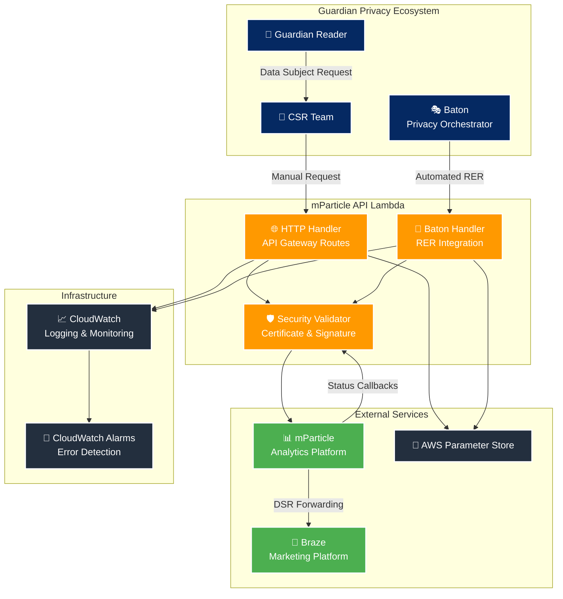
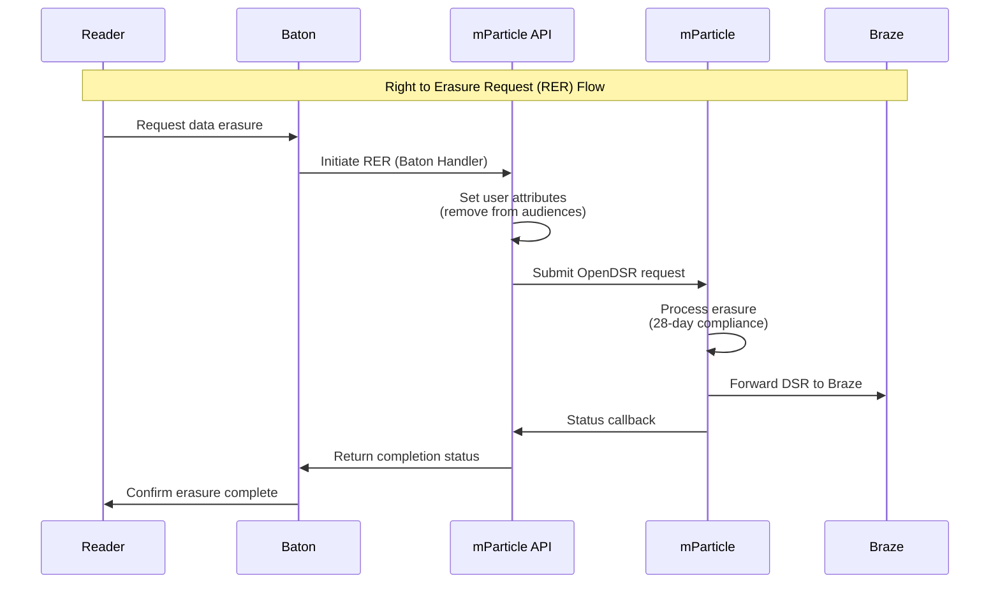

# 🏗️ Architecture Overview

## System Architecture

## Service Integration Flow

## Core Components

### 🔧 Core Features

#### 🎯 Data Subject Request Management
- **Submit DSRs**: Accept access, portability, and erasure requests in OpenDSR format
- **Status Tracking**: Real-time monitoring of request progress through mParticle
- **Automated Callbacks**: Secure webhook processing for status updates

#### 🛡️ Enterprise Security
- **Certificate Validation**: X.509 certificate chain verification for callbacks
- **Signature Verification**: RSA-SHA256 signature validation
- **Input Sanitization**: [Zod](https://zod.dev/) schema validation for all endpoints

#### 📊 Event Processing
- **Batch Upload**: Efficient event forwarding to mParticle
- **User Attribution**: Audience control during erasure waiting periods
- **Environment Isolation**: Separate development and production workspaces

#### 🔄 Baton Integration
- **Automated RER**: Seamless integration with Guardian's privacy orchestration platform
- **Cross-Account Access**: Secure Lambda invocation from Baton AWS account
- **Standardized Interface**: Implements Baton's DSR processing contract

## Technical Stack

### Runtime Environment
- **AWS Lambda**: Serverless function execution
- **Node.js 18**: Runtime environment
- **TypeScript**: Type-safe development

### Dependencies
- **Zod**: Input validation and schema parsing
- **@peculiar/x509**: Certificate validation
- **Jest**: Testing framework
- **Faker.js**: Test data generation

### AWS Services
- **API Gateway**: HTTP endpoint management
- **Parameter Store**: Configuration management
- **CloudWatch**: Logging and monitoring
- **IAM**: Access control and security

---

**Next:** [API Reference](api/README.md) | **Related:** [Getting Started](guides/getting-started.md)
