# 🏗️ Architecture Overview

## System Architecture

```mermaid
graph TB
    subgraph "Guardian Privacy Ecosystem"
        BATON[🎭 Baton<br/>Privacy Orchestrator]
        READER[📱 Guardian Reader]
    end
    
    subgraph "mParticle API Lambda"
        HTTP[🌐 HTTP Handler<br/>Callback Endpoint]
        BATON_H[🔄 Baton Handler<br/>RER Integration]
        VALIDATOR[🛡️ Security Validator<br/>Certificate & Signature]
    end
    
    subgraph "External Services"
        MPARTICLE[📊 mParticle<br/>Analytics Platform]
        BRAZE[📧 Braze<br/>Marketing Platform]
        PARAMS[🔧 AWS Parameter Store]
    end
    
    subgraph "Infrastructure"
        CW[📈 CloudWatch<br/>Logging & Monitoring]
        ALARMS[🚨 CloudWatch Alarms<br/>Error Detection]
    end

    %% Request Flows
    READER -->|Data Subject Request| BATON
    BATON -->|Automated RER| BATON_H
    
    %% Processing
    BATON_H --> VALIDATOR
    VALIDATOR --> MPARTICLE
    
    %% Data Flow
    MPARTICLE -->|Status Callbacks| HTTP
    HTTP --> VALIDATOR
    MPARTICLE -->|DSR Forwarding| BRAZE
    
    %% Configuration
    HTTP --> PARAMS
    BATON_H --> PARAMS
    
    %% Monitoring
    HTTP --> CW
    BATON_H --> CW
    CW --> ALARMS

    classDef guardian fill:#052962,stroke:#ffffff,stroke-width:2px,color:#ffffff
    classDef lambda fill:#ff9900,stroke:#ffffff,stroke-width:2px,color:#ffffff
    classDef external fill:#4CAF50,stroke:#ffffff,stroke-width:2px,color:#ffffff
    classDef aws fill:#232F3E,stroke:#ffffff,stroke-width:2px,color:#ffffff
    
    class BATON,READER guardian
    class HTTP,BATON_H,VALIDATOR lambda
    class MPARTICLE,BRAZE external
    class PARAMS,CW,ALARMS aws
```

## Service Integration Flow

## Core Components

### 🔧 Core Features

#### 🎯 Data Subject Request Management
- **Callback Processing**: Secure webhook processing for status updates from mParticle
- **Status Tracking**: Real-time monitoring of request progress through callbacks
- **Future Endpoints**: Test endpoints for DSR submission and status queries (not yet in production)

#### 🛡️ Enterprise Security
- **Certificate Validation**: X.509 certificate chain verification for callbacks
- **Signature Verification**: RSA-SHA256 signature validation
- **Input Sanitization**: [Zod](https://zod.dev/) schema validation for all endpoints

#### 📊 Event Processing
- **Future Feature**: Event forwarding capabilities for mParticle integration
- **User Attribution**: Audience control during erasure waiting periods
- **Environment Isolation**: Separate development and production workspaces

#### 🔄 Baton Integration
- **Automated RER**: Primary integration with Guardian's privacy orchestration platform
- **Cross-Account Access**: Secure Lambda invocation from Baton AWS account
- **Standardized Interface**: Implements Baton's DSR processing contract

## Technical Stack

### Runtime Environment
- **AWS Lambda**: Serverless function execution
- **Node.js 18**: Runtime environment
- **TypeScript**: Type-safe development

### Dependencies
- **Zod**: Input validation and schema parsing
- **@peculiar/x509**: Certificate validation
- **Jest**: Testing framework
- **Faker.js**: Test data generation

### AWS Services
- **API Gateway**: HTTP endpoint management
- **Parameter Store**: Configuration management
- **CloudWatch**: Logging and monitoring
- **IAM**: Access control and security

---

**Next:** [API Reference](api/README.md) | **Related:** [Getting Started](guides/getting-started.md)
