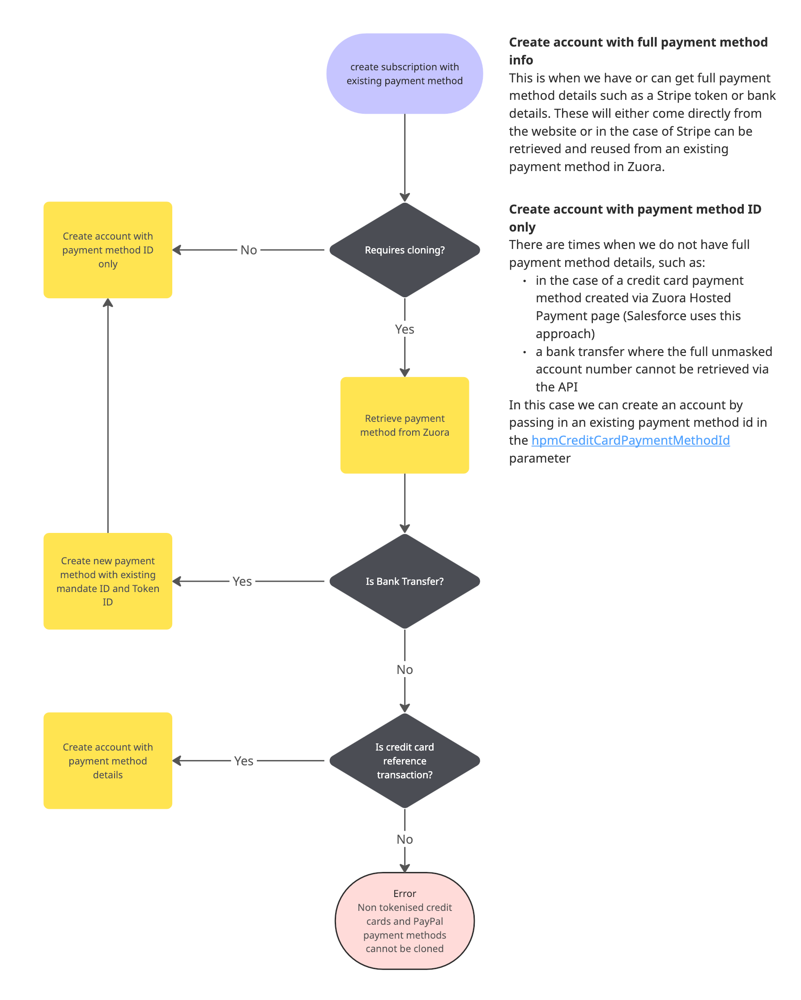

# new-subscription-api

## Overview
The new-subscriptions-api is an API which Salesforce uses to enable Customer Service Representatives (CSRs) to purchase 
to new subscriptions on behalf of customers.

It will replace the old new-product-api which is currently used for the same purpose, the main reasons for the migration are:
- To use the same account creation code for both the website and Salesforce. This will reduce the amount of code we have to maintain, reduce the risk of differences resulting in bugs, and make it easier to add new features in the future.
- Support promotions created via the promo code tool - the current discount system in Salesforce is very different to the system used by the website and is quite complicated to maintain.
- Migrate from the deprecated Subscribe / Amend Zuora API to the new Orders API.
- Migrate the codebase from Scala to Typescript in line with our strategic aims

## Implementation
The new-subscriptions-api is implemented as an API gateway in front of an AWS Lambda, authentication is via an API Gateway API key. 
The API exposes a single endpoint:

```
POST /subscription
```
Which expects a request body similar to the following:
```json
{
    "accountName": "Test Account",
    "createdRequestId": "a1b2c3d4-e5f6-7890-abcd-ef1234567899",
    "salesforceAccountId": "0011234567890ABCD",
    "salesforceContactId": "0031234567890ABCD",
    "identityId": "12345678",
    "currency": "GBP",
    "paymentGateway": "Stripe PaymentIntents GNM Membership",
    "existingPaymentMethod": {
        "id": "2c92c0f87568d97201756b1578b6069c",
        "requiresCloning": true
    },
    "billToContact": {
        "firstName": "John",
        "lastName": "Doe",
        "workEmail": "john.doe@example.com",
        "country": "GB"
    },
    "appliedPromotion": {
        "promoCode": "E2E_TEST_SPLUS_MONTHLY",
        "supportRegionId": "uk"
    },
    "productPurchase": {
        "product": "SupporterPlus",
        "ratePlan": "Monthly",
        "amount": 12
    }
}
```
The notable part of this is the existingPayment object:
```typescript
  existingPaymentMethod: {
    id: '8ad08ef39d670e4a019d6c9a762e1357',
    requiresCloning: true,
  }
```
This object contains an id which identifies a payment method object in Zuora and a boolean which tells the function whether it needs to be cloned before use.

### requiresCloning=false
If `requiresCloning` is false, the existing id can be passed directly to Zuora in the Orders API call we use to create the new account and subscription. It is passed in the `hpmCreditCardPaymentMethodId`
parameter - [Docs](https://developer.zuora.com/v1-api-reference/api/orders/post_order#orders/post_order/t=request&path=newaccount/hpmcreditcardpaymentmethodid)


### requiresCloning=true
If requiresCloning is true, the payment method is attached to another account and must be re-created first, how we do this depends on the type of payment method:
#### BankTransfer (GoCardless / BACS)
- We retrieve the existing payment method using the older [CRUD Payment Method API](https://developer.zuora.com/v1-api-reference/older-api/payment-methods/object_getpaymentmethod) - we need to use this API because it returns both the `MandateID` and `TokenId` which the newer API does not and both of these are needed for the clone to succeed.
- We then create a new 'orphaned' payment method unattached to an account. We need to use the CRUD API for this as well [docs](https://developer.zuora.com/v1-api-reference/older-api/payment-methods/object_postpaymentmethod) because it has an `ExistingMandate` parameter, which again is required for the clone to succeed.
- We then pass the id of the new payment method into the Orders API in the same way as with `requiresCloning=false` above.

#### CreditCardReferenceTransaction (Stripe)
CreditCardReferenceTransaction payment methods are slightly simpler to clone
- We retrieve the `tokenId` and `secondTokenId` from the existing payment method and pass them into the new account API call in the `newAccount.paymentMethod` parameter [Docs](https://developer.zuora.com/v1-api-reference/api/orders/post_order#orders/post_order/t=request&path=newaccount/paymentmethod).

#### CreditCard/PayPal
Non-tokenised credit card payment methods (ones where the full credit card details are held in Zuora) are not supported as we are unable to retrieve the credit card number to clone the account.
PayPal may be clone in the same way as a `CreditCardReferenceTransaction` but this is not implemented currently.

### This flow is detailed in this flow chart:


## How to Test

### Unit tests

```bash
pnpm test
```

### Integration tests

Runs against the CODE environment and makes real Zuora API calls. Requires AWS credentials with access to CODE.

```bash
pnpm it-test
```

### Manual testing

Send a `POST` request to the CODE endpoint, for instance with cURL:

```
curl --location 'https://new-subscription-api-code.support.guardianapis.com/subscription' \
--header 'Content-Type: application/json' \
--header 'x-api-key: [REPLACE_THIS_WITH_A_REAL_API_KEY]' \
--data-raw '{
    "accountName": "Test Account",
    "createdRequestId": "a1b2c3d4-e5f6-7890-abcd-ef1234567899",
    "salesforceAccountId": "0011234567890ABCD",
    "salesforceContactId": "0031234567890ABCD",
    "identityId": "12345678",
    "currency": "GBP",
    "paymentGateway": "Stripe PaymentIntents GNM Membership",
    "existingPaymentMethod": {
        "id": "2c92c0f87568d97201756b1578b6069c",
        "requiresCloning": true
    },
    "billToContact": {
        "firstName": "John",
        "lastName": "Doe",
        "workEmail": "john.doe@example.com",
        "country": "GB"
    },
    "appliedPromotion": {
        "promoCode": "E2E_TEST_SPLUS_MONTHLY",
        "supportRegionId": "uk"
    },
    "productPurchase": {
        "product": "SupporterPlus",
        "ratePlan": "Monthly",
        "amount": 12
    }
}'
```

Check the CloudWatch logs for execution details:

```
/aws/lambda/new-subscription-api-CODE
```

## External Documentation

- [Zuora Orders API](https://developer.zuora.com/v1-api-reference/api/tag/Orders/)
- [Zuora Order Actions](https://developer.zuora.com/v1-api-reference/api/operation/POST_Order/)
