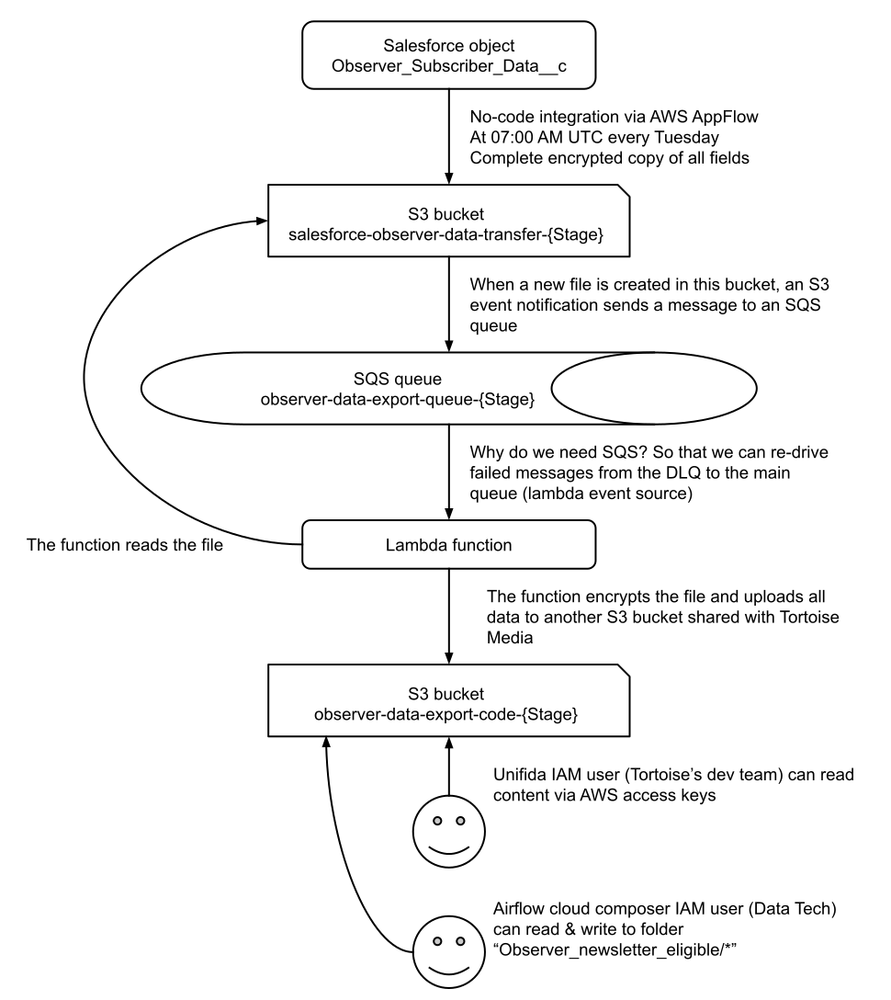

# Observer Data Export

## Overview

The **ObserverDataExport** project is designed to automate the process of exporting Observer-only subscriber data from Salesforce and securely encrypting it for further processing. The data is transferred from Salesforce to an S3 bucket and encrypted using AES-256-CBC encryption before being uploaded to a shared S3 bucket. The encryption ensures that only authorized users, such as **Unifida** (Tortoise's dev team), can access and decrypt the data. This project is scheduled to run every Tuesday at 7 AM UTC.

## Architecture

The architecture involves multiple AWS resources, including:

**AWS S3 Buckets**: For data storage, including the storage of encrypted files and manifests.
**AWS AppFlow**: For extracting data from the Observer Subscriber Data custom object in Salesforce into a CSV file
- **AWS Lambda**: For encrypting the Salesforce data and uploading it to the shared bucket.
- **AWS SQS**: For handling events triggered when new data is uploaded to the Salesforce data transfer bucket.
- **CloudWatch Alarms**: For monitoring and alerting in case of failures.

[Link to Google Draw Diagram](https://docs.google.com/drawings/d/10A6zS81k6fmk4meViSiY732NbZEKu5wM0R5J2--H5Ys/edit)

### Data Flow

1. **Salesforce Data Transfer**: Salesforce Observer subscriber data is exported weekly (every Tuesday at 7 AM UTC) using AWS AppFlow and transferred to an S3 bucket, **SalesforceObserverDataTransferBucket**.
2. **File Upload and Encryption**:
   - Once new data is uploaded to **SalesforceObserverDataTransferBucket**, an SQS event triggers an AWS Lambda function.
   - The Lambda function downloads the unencrypted data (CSV file) and encrypts it using AES-256-CBC.
   - The encryption key (AES) is itself encrypted using RSA, a public key from Unifida.
3. **Upload to Shared Bucket**:

   - The encrypted AES key, IV, and CSV data are uploaded to a **shared S3 bucket**, **UnifidaSharedBucketName**.
   - A manifest file is created for each upload that includes the paths to the encrypted AES key, IV, and CSV file, along with the MD5 hash of the CSV file for verification.

4. **Permission Management**:
   - **Unifida's IAM User**: An IAM user for Unifida (Tortoise's dev team) is created to access the files in the shared bucket. The user is able to decrypt the AES key using their RSA private key and use it to decrypt the data.
   - **DataTech IAM User**: Permissions are granted to the **DataTech IAM user** (Airflow Cloud Composer user from the AWS Ophan account) to write data to the **Observer_newsletter_eligible/** folder, which contains subscriber data for other products in addition to the Observer-only data.
5. **Bucket Expiration**:
   - **Shared Bucket**: The shared bucket has a **28-day expiration policy** for the data stored. It also has full CloudTrail enabled, including S3 data events, to monitor access to the bucket.
   - **Intermediate Bucket**: The intermediate bucket (used for unencrypted data) has a **1-day retention period** due to the sensitive nature of the data.

## Security and Access

1. **Unifida's Decryption Process**:
   - Unifida will be able to **decrypt the AES key** using their RSA private key.
   - They will then use the decrypted AES key and IV to **decrypt the CSV file** containing the Observer subscriber data.
   - To ensure the data integrity and that encryption was successful, Unifida can **verify the MD5 hash** of the CSV file against the provided MD5 signature in the manifest.

## Lambda Function

The Lambda function used for encryption and uploading data is triggered by an SQS event and performs the following actions:

- Fetches the public RSA key from the shared S3 bucket.
- Encrypts the AES key using RSA encryption.
- Encrypts the CSV file using AES-256-CBC encryption.
- Uploads the encrypted AES key, IV, and CSV file to the shared bucket.
- Creates a manifest file with the paths to the encrypted files and the MD5 hash of the CSV file.

## CloudWatch Alarm

A **CloudWatch Alarm** is set up to monitor the Lambda function's execution. If there are issues with the Lambda function (e.g., failure to process data), the alarm will trigger and alert the responsible team. The alarm monitors the **dead-letter queue** for failed Lambda invocations.

## Weekly Schedule

The Salesforce data extraction process is scheduled to run every **Tuesday at 7 AM UTC**, as defined in the cron expression `cron(0 7 ? * TUE *)`.

## Permissions Overview

- **Unifida IAM User**:
  - Can decrypt the AES key using their RSA key.
  - Can decrypt the CSV file using AES-256-CBC and the AES IV.
  - Can verify the encryption by comparing the MD5 hash in the manifest with the actual file.
- **DataTech IAM User**:
  - Has permissions to write to the **Observer_newsletter_eligible/** folder for the Observer data in subscriptions that include other products, not just Observer-only data.

## Conclusion

The **ObserverDataExport** project ensures secure handling and transfer of Observer subscriber data, providing Unifida with the tools to decrypt and verify the data while maintaining full audit and security controls on the AWS infrastructure.
