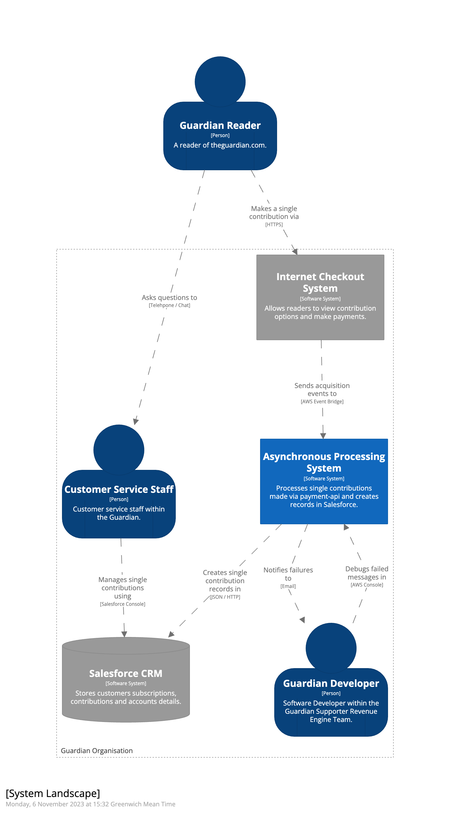

# Single Contribution Salesforce Writes

## Description

This project objective is to create records in Salesforce for each single contribution made via payment-api, to remove the need to backfilling them manually in Salesforce.

If you want to know more about the background, refer to this [document](https://docs.google.com/document/d/1bxkR5UzPcsImqNRAhBk1S0W8gz5AdbCo4YKaaDptW-k/edit#heading=h.lpda0x9x3rlh).

### System Landscape Diagram



### System Container Diagram


## Table of Contents

- [Installation](#installation)
- [Usage](#usage)
- [Tests](#tests)
- [Architectural diagrams in Visual Studio Code](#architectural-diagrams-in-visual-studio-code)

## Installation

Install dependencies for the `cdk` project in TypeScript:

```bash
cd cdk && yarn
```

## Usage

1. Make sure your local Java version is 8 or 11
2. From the root, start up the sbt console with `sbt`
3. Set current project with `project single-contribution-salesforce-writes`
4. Run `compile` to compile the project
5. Run `test` to run the tests

## Tests

- Automated tests:

  - You can run the project tests from the root as well with:

    ```scala
    sbt "project single-contribution-salesforce-writes" test
    ```

- Manual tests:
  - Make a single contribution from the [CODE site](https://support.code.dev-theguardian.com/uk/contribute)
  - From the Salesforce sandbox dashboard, check that the contribution record has been created [here](https://gnmtouchpoint--dev1.sandbox.lightning.force.com/lightning/r/Report/00O9E000001A5vkUAC/view)

## Architectural diagrams in Visual Studio Code

1. Download the [C4 DSL Extension](https://marketplace.visualstudio.com/items?itemName=systemticks.c4-dsl-extension)
2. Open the file `docs/workspace.dsl`
3. Choose the view you want to display and click on the link "Show as PlantUML Diagram"
