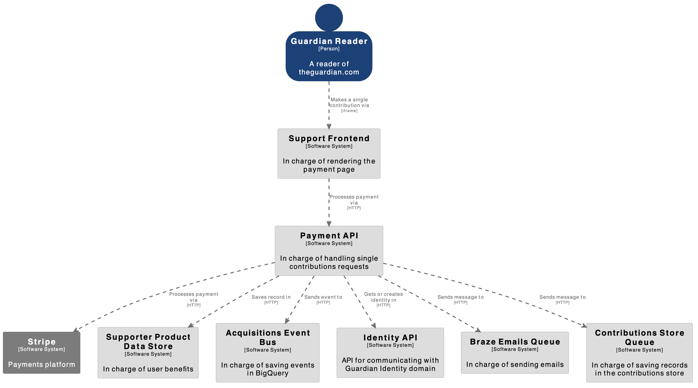
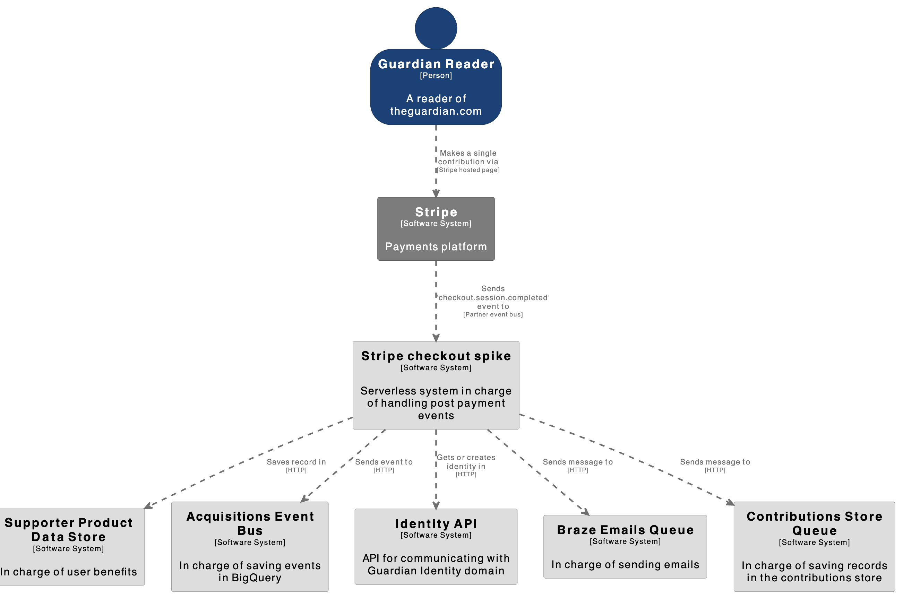

# Stripe Checkout Spike

## Overview

This project, Stripe Checkout Spike, is a technical spike aimed at exploring an alternative approach to handling the post-payment experience for single contributions using Stripe's hosted checkout pages. The spike is not merged into the production codebase and is not live, as it is still in the exploratory phase.

The purpose of this spike is to replicate the current single contributions checkout post-payment experience while leveraging Stripe's hosted pages. This approach aims to reduce the amount of code we need to maintain, improve developer experience, and provide additional flexibility for future enhancements.

## Key Objectives

- Replicate the post-payment experience: Ensure that the user experience after payment is consistent with the current single contributions checkout flow.

- Leverage Stripe's hosted pages: Use Stripe's hosted checkout pages to manage payments, products, and discounts.

- Eliminate the need for a frontend server: By using Stripe's hosted pages, we no longer need a dedicated frontend server to host checkout pages. This also opens up opportunities for marketing teams to quickly create and manage landing pages for campaigns.

- Event-driven architecture: Transition from a synchronous payment and post-payment task flow to an asynchronous, event-driven architecture.

- Explore potential benefits: Evaluate the advantages of this approach, including reduced code maintenance, improved developer experience, and enhanced flexibility for A/B testing and fallback mechanisms.

## Potential Benefits

- Less code to maintain: By using Stripe's hosted pages, we can offload payment processing logic to Stripe, reducing the complexity of our codebase.

- Improved developer experience: Stripe's developer tools make it easier to manage products, discounts, and integrations.

- Easier A/B testing: Stripe's hosted pages allow for simpler A/B testing of banner messaging and other UI elements.

- Integration with AWS Event Bus: Leverage Stripe's no-code integration with AWS Event Bridge to streamline event-driven workflows.

- Fallback mechanism: Provides a backup payment flow in case the main checkout system experiences downtime.

- Marketing flexibility: Stripe's hosted pages can be used by marketing teams to quickly create, open, and close landing pages for campaigns without requiring engineering support.

## Current Architecture

The current architecture for handling single contributions involves the payment-api, which performs all payment and post-payment tasks synchronously. These tasks include:

- Processing the payment.

- Sending a thank-you email.

- Saving records in the contributions store and supporter data store.

- Saving soft opt-ins.

- Sending data to the acquisition event bus for BigQuery.

This synchronous approach can lead to longer wait times for customers, as they must wait for all tasks to complete before receiving a response.

## Proposed Architecture

The proposed architecture for this spike is event-driven and asynchronous. Here's how it works:

- User makes a single contribution: The user is redirected to a Stripe-hosted payment page.

- Payment event is sent to AWS Event Bridge: After the payment is processed, Stripe sends an event to AWS Event Bridge via a no-code integration.

- Event triggers a Lambda function: A rule is created in AWS Event Bridge to route the event to a Lambda function.

- Lambda handles post-payment tasks: The Lambda function asynchronously handles all post-payment tasks, such as sending thank-you emails, saving records, and sending data to BigQuery.

This approach ensures that the customer does not need to wait for post-payment tasks to complete, improving the overall user experience.

## Demo

A demo of this spike is available for testing purposes. You can access it via the following HTTPS URL:
[https://buy.stripe.com/test_4gw4j66dl5nD9fqbII](https://buy.stripe.com/test_4gw4j66dl5nD9fqbII)

## Why This Is a Spike

This project is a spike, meaning it is an exploratory effort to evaluate the feasibility and potential benefits of the proposed architecture. It has not been merged into the production codebase because:

- It is still in the testing and evaluation phase.

- The proposed architecture has not yet been validated for production use.

- Further refinement and stakeholder approval are required before it can be considered for integration.

## Next Steps

- Evaluate the spike: Review the demo and assess whether the proposed architecture meets the project's objectives.

- Gather feedback: Collect input from stakeholders, developers, and QA teams to identify potential improvements or concerns.

- Plan for production: If the spike is successful, outline the steps required to integrate this approach into the production codebase.
