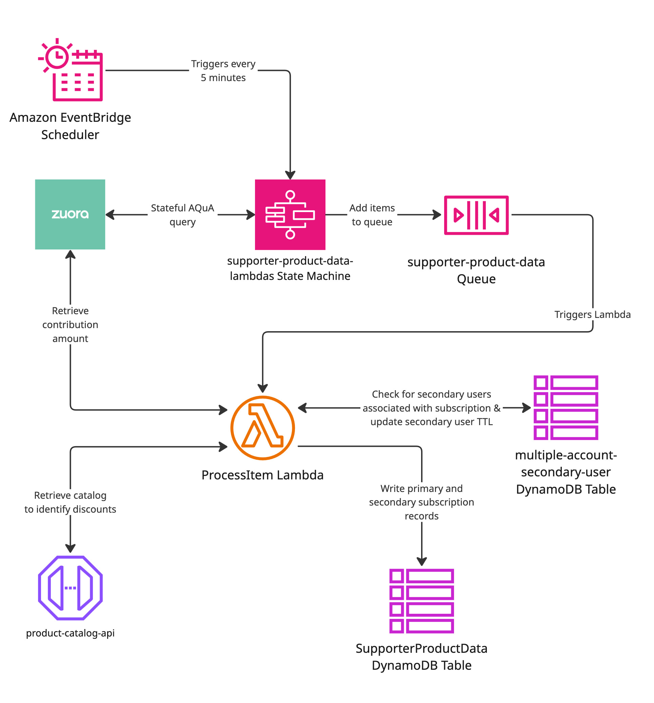
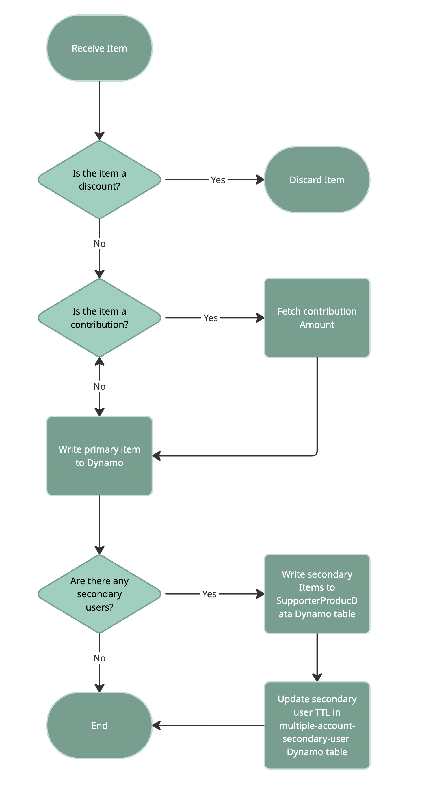

# supporter-product-data-lambdas
This project contains the Supporter Product Data sync pipeline. It runs a Step Functions state machine to:
1) query Zuora for changed subscriptions (incremental or full)
2) upload the export to S3
3) enqueue rate plan items to SQS
4) process SQS messages and write to the SupporterProductData DynamoDB table.
## How to test
- Unit tests: `pnpm --filter supporter-product-data-lambdas test`
- Integration tests: `pnpm --filter supporter-product-data-lambdas it-test`
## Infrastructure Diagram

## Flowchart For The Process Item Lambda

## References
- Google slides: https://docs.google.com/presentation/d/1WNN-JRgHiE7Hap_zPs81UmUal2Jl7ssjCFGv5xgR2XE/edit#slide=id.p
- Infrastructure Diagram & Flowchart: https://miro.com/app/board/uXjVHESx60U=/?focusWidget=3458764675896064104