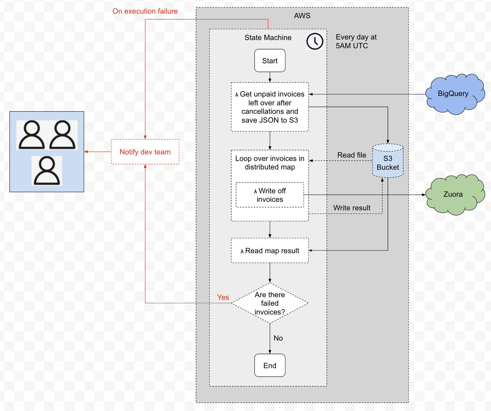

## 🔁 Scheduled job writing off unbalanced invoices left over after cancellations

A scheduled job that automatically writes off unbalanced invoices left behind after incomplete subscription cancellations.

## 🔍 Logic

- Target only recent cancellations—specifically those that occurred 1 to 5 days ago.
- Identify all unbalanced invoices linked to these cancelled subscriptions, whether or not the invoices were directly tied to the cancellation.

## 🕐 Schedule

The job runs daily at 5:00 AM.

## 🔧 API Used

The invoice adjustment is done via the Zuora invoice item adjustment API call: https://developer.zuora.com/v1-api-reference/older-api/operation/Object_POSTInvoiceItemAdjustment/.

The strategy for adjusting the invoice is:

1. Check that balance is not zero
2. Get invoice items
3. Get taxation items also to have an array of adjustable items
4. Sort items based on the `availableToCreditAmount` field to reduce the number of API calls
5. Stop when balance is zero

## 🧾 Background & Context

This job addresses unbalanced invoices left by three known sources:

- **MMA**: The MMA cancellation process may leave positive invoices behind if a payment failed. These are now written off.
- **Autocancel**: The auto-cancel process can cancel a subscription but fail to balance positive and negative invoices. These are also written off.
- **Salesforce/UI**: Manual cancellations done via Salesforce or the Zuora UI may leave leftover invoices. These are included as well.

## 📌 Future Considerations

Once the upstream systems (MMA, Autocancel, Salesforce) are updated to correctly zero out invoice balances at cancellation time, this job will no longer be necessary.

## 🧩 Architecture Overview

This job is implemented using AWS Step Functions with two main steps:

### 1. 📥 Invoice Fetch (Lambda Function)

- Queries BigQuery to find all unbalanced invoices related to recent cancellations (within the past 1–5 days).
- Saves the result as a JSON file in S3 ([write-off-unpaid-invoices-prod](https://eu-west-1.console.aws.amazon.com/s3/buckets/write-off-unpaid-invoices-prod?region=eu-west-1&tab=objects&bucketType=general)).

### 2. 🔁 Invoice Write-Off (Distributed Map + Lambda)

- A Distributed Map state reads the JSON file from S3 and processes invoices in batches of 1.
- Each batch is passed to a Lambda function, which:
  - Iterates over the invoices in the batch.
  - For each invoice, uses the [Zuora Action POST Create API](https://developer.zuora.com/v1-api-reference/api/operation/Action_POSTcreate/) to adjust invoice items until the balance reaches zero.

### 3. 📬 Post-Processing & Notification

- After the Distributed Map completes, a Step Functions SDK integration reads the results file from S3.
- It checks whether a FAILED file exists:
  - If the FAILED file is present: it means some invoices couldn't be written off. A notification is sent to the team with a link to the FAILED file for review.
  - If no FAILED file is found: the process completes successfully with no further action required.

### Process flow

[Link to Google draw](https://docs.google.com/drawings/d/1NvOgz0p-3R7uS3A2oeTN3qqGc7fcixXRCfXldFT-dqM/edit)

### State machine

