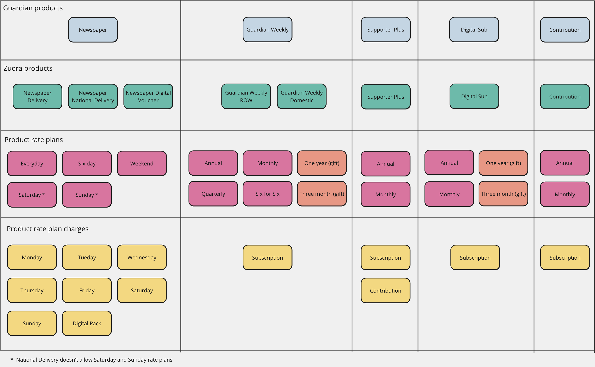

# Product Catalog Module
### If you are looking for how to regenerate catalog types, jump to the [implementation section](#implementation)

---------------------------------
## Introduction
This module defines a simplified product catalog model and mappings between that structure and the larger, more general catalog structure which we export from Zuora.

There are two main types involved in our product definitions and they map onto the identically named objects in the [Zuora product catalog](https://knowledgecenter.zuora.com/Zuora_Billing/Build_products_and_prices/Basic_concepts_and_terms/AAA_Product_Catalog_Concepts)
## `Product`
This represents a particular product defined in the Zuora catalog. 
Available values are:

- NationalDelivery
- HomeDelivery
- SubscriptionCard

which are all types of Newspaper subscription

- GuardianWeeklyDomestic
- GuardianWeeklyRestOfWorld

which are both types of Guardian Weekly

- DigitalSubscription
- SupporterPlus
- Contribution

## `ProductRatePlan`
This maps to a Zuora product rate plan. Each ProductRatePlanKey belongs to a specific zuora product so it is a generic type with the signature:
```typescript
type ProductRatePlanKey<P extends ProductKey>
```
Product rate plans for each product are:

- HomeDelivery & SubscriptionCard
  - Saturday
  - Sunday
  - Weekend
  - Sixday
  - Everyday
  

- NationalDelivery
  - Weekend
  - Sixday
  - Everyday // National delivery doesn't have a Saturday and Sunday option


- GuardianWeeklyDomestic & GuardianWeeklyRestOfWorld
  - Monthly
  - Annual
  - Quarterly
  - SixWeekly
  - OneYearGift
  - ThreeMonthGift


- DigitalSubscription
  - Monthly
  - Annual
  - OneYearGift
  - ThreeMonthGift

 
- SupporterPlus
  - Monthly
  - Annual

This diagram shows all product keys and their associated product rate plan keys:


# Usage
The product catalog object contains pricing information and Zuora ids for product rate plans and product rate plan charges (needed when creating subscriptions). For instance if I want to find the GBP price to get the Newspaper delivered on a Saturday I can use the following:
```typescript
import { getProductCatalogFromApi } from '@modules/product-catalog/api';

const catalog = await getProductCatalogFromApi('CODE');
const price = catalog.products.HomeDelivery.ratePlans.Saturday.pricing.GBP;
// price is 19.99

```
If I need to get the Contribution charge id from the Supporter plus product which is needed when setting the contribution amount on a Supporter plus subscription I can use the following: 
```typescript
import { getProductCatalogFromApi } from '@modules/product-catalog/api';

const catalog = await getProductCatalogFromApi('PROD');
const contributionChargeId = catalog.products.SupporterPlus.ratePlans.Monthly.charges.Contribution.id;
```
## Implementation
The mapping between our object model and Zuora's catalog is defined in the files `generateProductCatalog.ts`, `zuoraToProductNameMapping.ts` and `generateTypeObject.ts`.

These contain functions to generate the product catalog json from the Zuora catalog and also to create a type object which we use to define the types of which the catalog is comprised. This type object is written to `generateTypeObject.ts` and checked into the repo. If it ever needs to be regenerated, it can be done so by running `pnpm 

Whenever the catalog changes these json files can be regenerated by running the command
```shell
pnpm --filter product generateMapping
```
from the root of the repository.