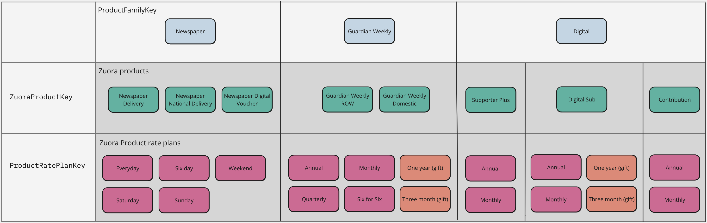

# Product Module
This module defines our product structure and the mapping between that structure and the Zuora catalog which holds
pricing information.

There are three main types involved in our product definitions:
## `Product` 
This represents a product which we sell, available values are 
- `Guardian Weekly`
- `Newspaper`
- `Supporter Plus`
- `DigitalSubscription`
- `Contribution`
## `DeliveryOption`
This represents the method of delivery of a particular product, it is of most relevance to Newspaper and Guardian Weekly which have the available values of 
### Newspaper:
- `NationalDelivery`
- `HomeDelivery`
- `SubscriptionCard`
### Guardian Weekly
- `Domestic`
- `RestOfWorld`

For digital only products (Supporter Plus, DigitalSubscription and Contribution) this value will always be `Digital`
## `ProductOption`
This describes specific varieties or flavours of a product. For example Newspaper as the following product options:
- `Saturday`
- `Sunday`
- `Weekend`
- `Sixday`
- `Everyday`
                                                       
DigitalSubscription has the product options
- `Monthly`
- `Annual`
- `OneYearGift`
- `ThreeMonthGift`

This diagram shows the mapping between this type model and the Zuora catalog:


# Usage
By providing a `Product`, `DeliveryOption` and `ProductOption` we can map to any [product rate plan](https://knowledgecenter.zuora.com/Zuora_Central_Platform/API/G_SOAP_API/E1_SOAP_API_Object_Reference/ProductRatePlan) in the Zuora catalog and from that we can retrieve the pricing information for that particular configuration.
```typescript
import { getZuoraCatalog } from '@modules/catalog/catalog';
import { getProductRatePlanId } from '@modules/product/productToCatalogMapping';

const stage = 'CODE';
const catalog = await getZuoraCatalog(stage);

const productRatePlanId = getProductRatePlanId(
    stage,
    'Newspaper',
    'HomeDelivery',
    'Saturday',
);
const price = catalog.getCatalogPrice(productRatePlanId, 'GBP');
// price is 19.99

```

## Implementation
`Product` is defined as a union type, `DeliveryOption` and `ProductOption` are generic types which take a type parameter specifying the product they are valid for, this ensures that we only use options which are appropriate for the given product

```typescript
import {getProductRatePlanId} from "./productToCatalogMapping";

const productRatePlanId = getProductRatePlanId(
    'CODE',
    'GuardianWeekly',
    'Digital', // TS2345: Argument of type "Digital" is not assignable to parameter of type "RestOfWorld" | "Domestic"
    'Monthly',
);
```
