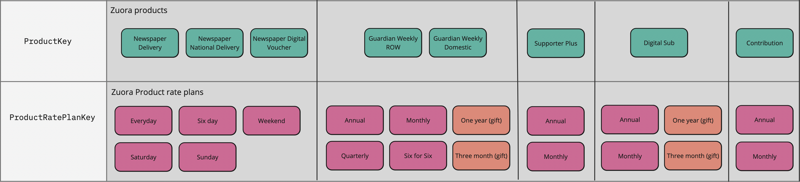

# Product Module
### If you are looking for how to regenerate catalog mappings, jump to the [implementation section](#implementation)

---------------------------------
## Introduction
This module defines a model to describe our product structure and the mapping between that structure and the Zuora catalog which holds pricing information.

There are two main types involved in our product definitions:
## `ProductKey`
This maps onto a particular product defined in the Zuora catalog. 
Available values are:
#### Newspaper:
- `NationalDelivery`
- `HomeDelivery`
- `SubscriptionCard`
#### GuardianWeekly
- `Domestic`
- `RestOfWorld`
#### Digital
- `DigitalSubscription`
- `SupporterPlus`
- `Contribution`

## `ProductRatePlanKey`
This maps to an individual product rate plan. Each ProductRatePlanKey belongs to a specific zuora product so it is a generic type with the signature:
```typescript
type ProductRatePlanKey<P extends ProductKey>
```
Examples of product options for particular products are:

- `HomeDelivery`
  - `Saturday`
  - `Sunday`
  - `Weekend`
  - `Sixday`
  - `Everyday`
  

- `NationalDelivery`
  - `Weekend`
  - `Sixday`
  - `Everyday` // National delivery doesn't have a Saturday and Sunday option


- `DigitalSubscription`
  - `Monthly`
  - `Annual`
  - `OneYearGift`
  - `ThreeMonthGift`

 
- `SupporterPlus`
  - `Monthly`
  - `Annual`

This diagram shows all product keys and their associated product rate plan keys:


# Usage
By providing a `ProductKey` and `ProductRatePlanKey` we can map to any [product rate plan](https://knowledgecenter.zuora.com/Zuora_Central_Platform/API/G_SOAP_API/E1_SOAP_API_Object_Reference/ProductRatePlan) in the Zuora catalog and from that we can retrieve the pricing information for that particular configuration. For instance if I want to find the GBP price to get the Newspaper delivered on a Saturday I can use the following:
```typescript
import { getZuoraCatalog } from '@modules/catalog/catalog';
import { getProductRatePlan } from '@modules/product/productCatalogMapping';

const stage = 'CODE';
const catalog = await getZuoraCatalog(stage);

const productRatePlan = getProductRatePlan(
    stage,
    'Newspaper',
    'HomeDelivery',
    'Saturday',
);
const price = catalog.getCatalogPrice(productRatePlan.id, 'GBP');
// price is 19.99

```
The way that the key types `ProductFamilyKey`, `ZuoraProductKey` and `ProductRatePlanKey` are defined in a dependent hierarchy ensures that we can only use options which are appropriate for the given product

```typescript
import {getProductRatePlanId} from "./productToCatalogMapping";

const productRatePlan = getProductRatePlan(
    'CODE',
    'GuardianWeekly',
    'HomeDelivery', // TS2345: Argument of type "Digital" is not assignable to parameter of type "RestOfWorld" | "Domestic"
    'Monthly',
);
```
The product rate plan object also holds information about the charges that plan contains, and that charge info is also strongly typed to the particular product variant.
```typescript
import {getProductRatePlanId} from "./productToCatalogMapping";

const mondayRatePlanChargeId = getProductRatePlan(
      'CODE', 
      'Newspaper', 
      'NationalDelivery', 
      'Everyday'
).charges.Monday

// If we try to access a charge which doesn't exist we will get a compile error 
const sundayRatePlanChargeId = getProductRatePlan(
        'CODE',
        'Newpaper',
        'NationalDelivery',
        'Sixday'
).charges.Sunday // TS2339: Property Sunday does not exist on type


```
## Implementation
The mapping between our object model and Zuora's catalog is defined in two json files `codeCatalogMapping.json` and `prodCatalogMapping.json`.  These are actually generated from the zuora catalog itself using the functions in `generateProductCatalog.ts`. 

Whenever the catalog changes these json files can be regenerated by running the command
```shell
pnpm --filter product generateMapping
```
from the root of the repository.